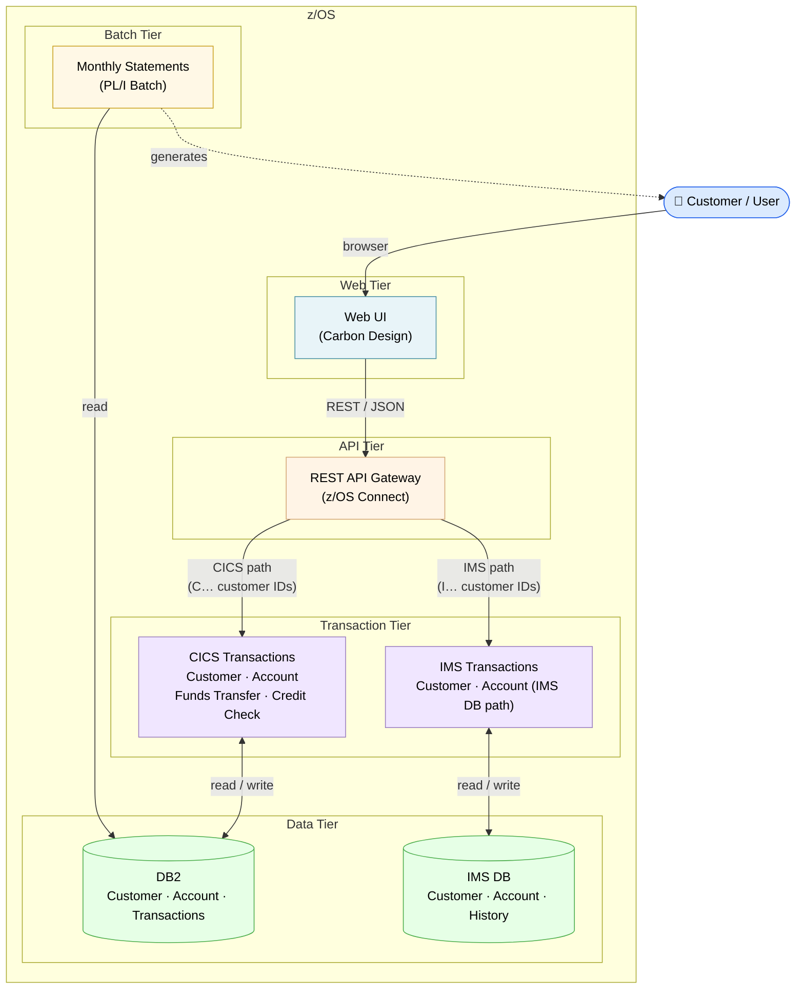
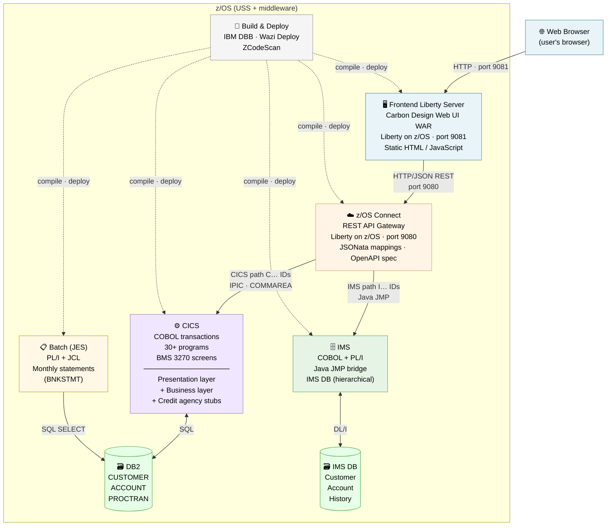
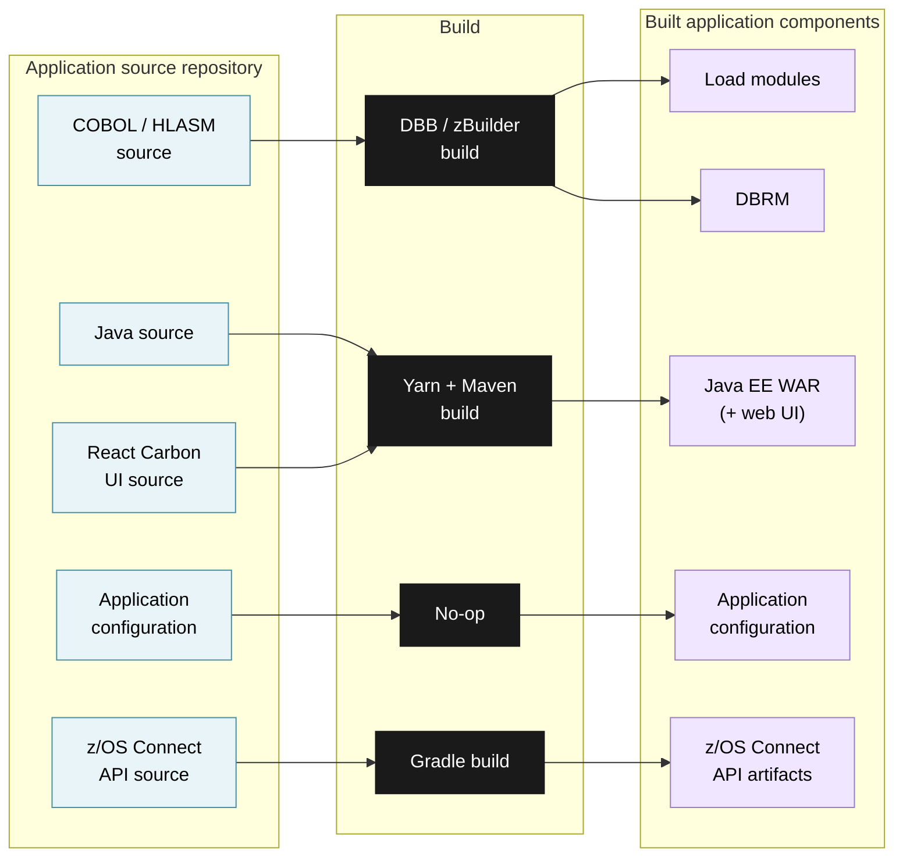
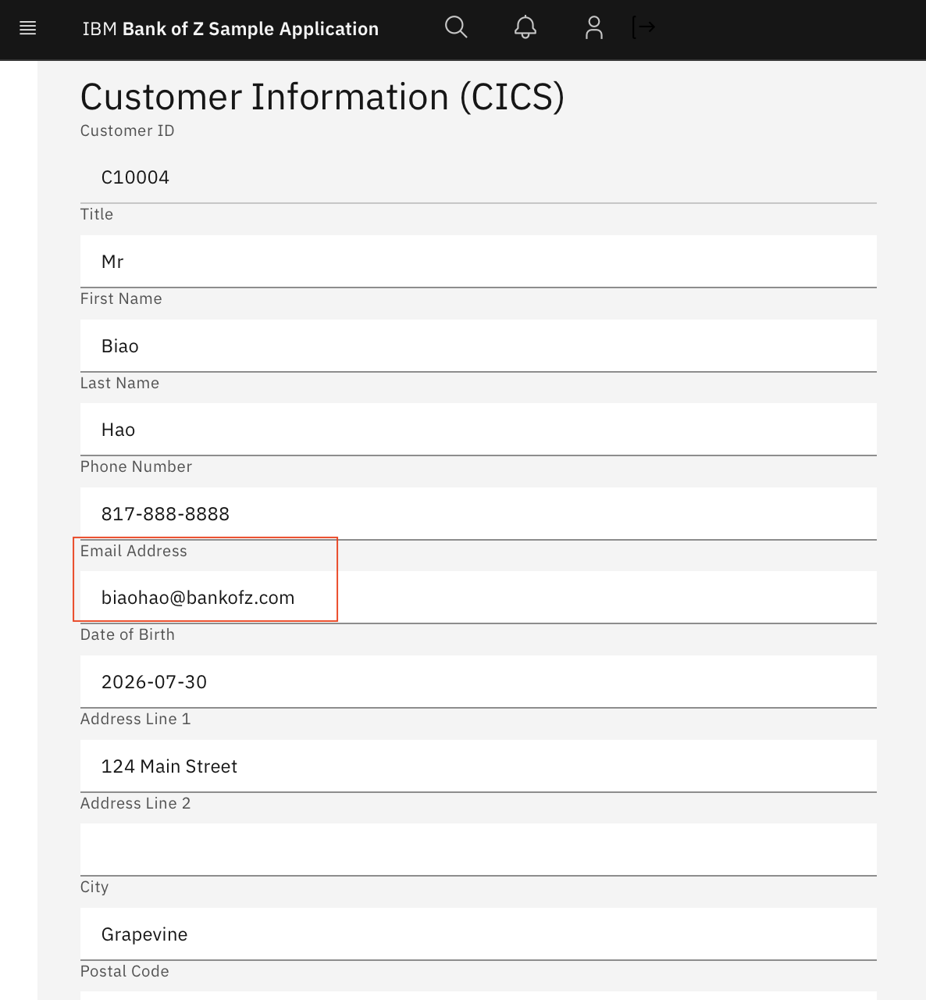

# AI That Speaks Mainframe: Accelerating Z Modernization with IBM Bob Premium Package for Z
**Author:** Biao Hao (biaohao@us.ibm.com) | *Last updated: 2026-09-11*

> This demo is built on top of the [Bank of Z](https://github.com/IBM/Bank-of-Z) application, forked in late July 2026 (commit 45454d4 as in the `base` branch). The enhancements are in branches with the prefix `bobz-demo`, such as `bobz-demo/email-added,` which includes code changes for adding an email to the customer record.

**Goal:** Show how IBM Bob Premium Package for Z (PPZ) accelerates understanding, analysis, and safe delivery of changes across a real multi-language mainframe application — and how it can be extended to fit any team's standards.

---

## Agenda
*Illustrative - select from the full list of demo scenarios, depending on focus and time available.*

| Step | Topic | Time | Key message |
|---|---|---|---|
| [1](#step-1--introduction-the-agent-and-the-app) | Introduction — Bob, PPZ, Bank-of-Z, Build and Deploy on Z | 5 min | *Bob starts from the same frontier model as Claude Code — PPZ is what makes it useful on Z.* |
| [2](#step-2--multi-language-program-explanation) | Multi-language flow explanation | 10 min | *Five files, five languages, one coherent answer — no copy-paste.* |
| [3](#step-3--customer-audit-trail-analysis) | Customer audit trail analysis | 8 min | *A compliance question answered in 60 seconds vs. a full day.* |
| [4a](#4a--impact-analysis) | Add email — impact analysis | 8 min | *15 components. The hidden inline struct trap — caught before anyone wrote a line of code.* |
| [4b](#4b--implementation-plan) | Add email — implementation plan | 5 min | *Exact byte positions in COMMAREA. Not 'here's what to change' — 'here's exactly how'.* |
| [4c](#4c--code-changes) | Add email — code changes | 5 min | *Bob makes all the code changes across 30+ files — COBOL, BMS, z/OS Connect, Web UI. It also introduced and fixed 7 bugs, caught at compile, deploy, and runtime.* |
| [4d](#4d--build-deploy-and-demo) | Add email — build, deploy & live UI | 5 min | *This field didn't exist this morning. It's live on Z now.* |
| [5](#step-5--zcodescan-custom-rule-enforcement-before-commit) | ZCodeScan pre-commit review | 5 min | *Your rules, enforced by AI, before the code ever reaches CICS.* |
| [6](#step-6--customizing-bob) | Customizing Bob | 5 min | *Every other AI tool is a black box. Bob's behavior is version-controlled YAML.* |
| [7](#step-7--summary-and-next-steps) | Summary & next steps | 3 min | *Pick one change request. Run an impact analysis. Compare it to how long it takes today.* |
| [A1](#a1--pli-batch-program-analysis--code-change) | PL/I batch program analysis | 8 min | *PL/I is not an afterthought — explain and change a 912-line batch program in one prompt.* |
| [A2](#a2--cobol-funds-transfer-program-logic--failure-path-analysis) | Funds transfer failure path analysis | 8 min | *Deadlock prevention, partial rollback, and abend codes — all traced from source.* |
| [A3](#a3--ims-database-analysis-ibgcudat-segments-and-customercustaccs-relationship) | IMS database analysis | 8 min | *IMS DL/I, PSBs, DBDs — Bob reads assembly source and explains the access boundary.* |
| [A4](#a4--cics-cobol-refactor-crecust-async-credit-check) | CRECUST async credit check refactor | 8 min | *530 lines extracted into a clean service interface. Ready to swap for an API call.* |

[↓ Acknowledgements](#acknowledgements)

---

## Step 1 — Introduction: The Agent and the App

> **Presenter note:** See `bobz-demo/1x-bob-and-ppz-overview.md` for the full product overview, comparison table, and talking points.

---

### 1a — What Is IBM Bob?

What you're looking at is **IBM Bob** — IBM's AI SDLC partner. It's available as **Bob IDE** (VS Code chat) and **Bob Shell** (terminal CLI). Bob combines **intelligent multi-model orchestration** with an agentic tool loop that reads files, queries codebases, runs commands, and reasons across multiple sources in a single turn. It is not a chatbot you paste snippets into.

**Bob vs the competition — 30-second framing:**

| | GitHub Copilot | Claude Code | IBM Bob |
|---|---|---|---|
| **Model quality** | Frontier (GPT, Claude, Gemini) | Frontier (Claude Sonnet / Opus) | Frontier — intelligent multi-model routing |
| **Inline completion** | ✅ Best-in-class | ❌ No tab completion | ✅ Yes |
| **Multi-file agent** | ✅ Yes | ✅ Yes | ✅ Yes |
| **Customizable modes / skills** | ✅ Yes | ✅ Yes | ✅ Team-authored Markdown, version-controlled |
| **Z / mainframe awareness** | ❌ None | ❌ None | ✅ Via PPZ extensions |


On general coding tasks, **Bob** is on par with Copilot and Claude Code — frontier models, agentic editing, customizable modes and skills. The question is what you build on top of that foundation — and that's where **Bob Premium Package for Z** comes in.

---

### 1b — What Is Bob Premium Package for Z (PPZ)?

**Bob Premium Package for Z** — or Bob PPZ — adds the Z-specific capability layer that turns Bob from a general-purpose AI SDLC partner into a mainframe-aware AI engineer. It ships as extensions to Bob IDE and Bob Shell across four pillars: Workflows, Application Analysis (Z Understand), Code Capabilities, and Integrations.


Source: [IBM Docs — Bob PPZ 3.0 Solution Architecture](https://www.ibm.com/docs/en/bobz/3.0.0?topic=overview-solution-architecture)


**Components in the architecture diagram:**
1. **Architect and Developer** work in **Bob IDE** or **Bob Shell**; the local mainframe codebase is read directly
2. **IBM Bob** (SaaS) hosts the agent with intelligent multi-model orchestration; LLM requests route to managed services (e.g. AWS Bedrock) via the IBM Bob cloud backend (on-prem deployment available Q3 2026)
3. **PPZ extensions** — Z Understand (knowledge graph + agent tools, running on a Linux VM s390x or x86) and ZCodeScan (team-defined static analysis rules)
4. **z/OS (remote)** — the mainframe target; Bob builds and deploys changes via DBB and Wazi Deploy

**PPZ adds four pillars that no other AI tool has for Z:**

| Pillar | What it adds |
|---|---|
| **Workflows** | Guided multi-step processes from the Bob chat interface: generate documentation, refactor COBOL/PL/I into modular services, generate or sync a data dictionary |
| **Application Analysis (Z Understand)** | Pre-indexed knowledge graph of the entire codebase — programs, copybooks, DB2 tables, call chains, paragraph-level control flow — queryable by the agent in real time |
| **Code Capabilities** | Z-aware generation, explanation, business-rule extraction, refactoring, and documentation across COBOL, JCL, PL/I, REXX, and Assembler |
| **Integrations** | Z Open Editor (MCP tools), ZCodeScan (team-defined YAML rule enforcement), and z/OS Debugger — usable directly from Bob IDE or Bob Shell |


**Key differentiator:**
- General AI tools (such as GitHub Copilot) can grep for `COPY CUSTOMER`. Bob PPZ queries the **Z Understand graph** and returns every program that copies it, which need a DB2 DBRM rebind, which have a BMS dependency, and which are PL/I rather than COBOL — in one query.
- This is your rules, your workflows, your institutional knowledge — encoded once and applied consistently by AI. When a senior developer retires, their expertise doesn't walk out the door. It lives in a YAML file and a Markdown skill.

---

### 1c — The App: Bank-of-Z

The application used for the demo, [Bank-of-Z](https://github.com/IBM/Bank-of-Z), is a multi-language banking application running on IBM Z — it has CICS transactions, IMS, DB2, PL/I batch, z/OS Connect REST APIs, and a web UI.


**Logical Architecture:**


  

**Key messages from this diagram:**
- **Everything is inside z/OS** — Web UI, API Gateway, transactions, databases, batch — all z/OS
- **One API, two transaction engines** — CICS for relational (DB2), IMS for hierarchical (IMS DB); routing is transparent to the user
- **Batch closes the loop** — monthly statement generation reads DB2 and delivers output to the customer


**Bank-of-Z at a glance:**

| Layer | Technology |
|---|---|
| Web UI | HTML / JavaScript (Carbon Design) |
| API Gateway | z/OS Connect with JSONata mappings |
| CICS Presentation | COBOL + BMS 3270 maps |
| CICS Business Programs | COBOL (30+ programs, DB2 backend) |
| IMS Path | COBOL + PL/I + Java bridge (IMS DB backend) |
| Batch Reporting | PL/I + JCL |
| Data | DB2 (CUSTOMER, ACCOUNT, PROCTRAN) + IMS DB |
| Build & Deploy | IBM DBB, Wazi Deploy, ZCodeScan |




For the full program-level detail, open `bobz-demo/1x-bank-of-z-architecture.md` — **Detailed View** section.

**Key points in the architecture diagram:**

- The **two runtime paths** — CICS (customer IDs `C…`) and IMS (customer IDs `I…`) — both exposed through the same z/OS Connect REST gateway; routing is client-side in `api.js`
- The **presentation / business separation** inside CICS: BNK1xxx programs handle 3270 screens and call business programs via `EXEC CICS LINK`
- The **five async credit agency child tasks** (`CRDTAGY1`–`5`) spawned by `CRECUST` using CICS containers and `RUN TRANSID` — a sophisticated CICS Async API pattern
- The **audit trail** — every CICS mutation (INSERT/UPDATE/DELETE on CUSTOMER or ACCOUNT) writes to `PROCTRAN`
- The **batch path** — `BNKSTMT.pli` (PL/I) running under JES to generate monthly statements, reading from all three DB2 tables
- The **build pipeline** — DBB impact build triggers recompile of all copybook dependents; Wazi Deploy promotes load modules; ZCodeScan enforces standards before commit


Every scenario you'll see today involves real code from this application — real cross-language tracing, real impact analysis, real code changes deployed on Z. Nothing is mocked or pre-computed.

[↑ Agenda](#agenda)

---

### 1d — Build and Deploy on Z

Automatically provision a full application stack including DB2, CICS, IMS, z/OS Connect, and a Liberty frontend server, then build and deploy the application from the source.
- Application compilation, configuration, deployment procedures - using Bob to troubleshoot
- Installation workflow: verify prerequisites → configure target environment → install tools → build → deploy → verify

**Deployment architecture — build pipeline:**



**CI/CD toolchains:**

| Mode | Tools |
|---|---|
| Traditional CI/CD (SDLC) | ADFz (File Manager, Fault Analyzer, IDz+), TAz, WCA4Z v2, open source (Python, Node), Zowe |
| **Agentic CI/CD (ADLC)** | All SDLC tools + IBM Bob + Premium Package for Z + TAz Integration + Pipeline Automation |

Source: [Build and Deployment Architecture](https://ibm.github.io/Bank-of-Z/docs/architecture/build-and-deployment.html)

[↑ Agenda](#agenda)

---

## Step 2 — Multi-Language Program Explanation

> **Presenter note:** Switch to **Z Architect** mode. See `bobz-demo/2-multi-language-program-explanation.md` for the full pre-captured output.

### Prompt

> Explain the complete end-to-end flow when a user creates a new customer in the Bank of Z web UI. Start from the JavaScript fetch call in api.js, trace through the z/OS Connect JSONata request mapping, into the CICS presentation program BNK1CCS.cbl, then CRECUST.cbl — including the asynchronous CICS child tasks it spawns to the five credit agency stubs, how it aggregates credit scores using CICS containers, and finally how it writes to DB2. Explain what happens at each layer if all five credit agency child tasks time out before returning.

### What Bob produces

Bob reads **five files simultaneously** across five technology layers in a single pass:

1. `src/frontend/js/api.js` — JavaScript fetch call
2. `src/api/src/main/operations/%2Fcustomers/post/request.yaml` — z/OS Connect JSONata mapping
3. `src/base/cics/cobol/BNK1CCS.cbl` — CICS presentation program
4. `src/base/cics/cobol/CRECUST.cbl` — Business program with async credit checks
5. `src/base/cics/cobol/CRDTAGY1.cbl` — Credit agency stub

It produces:
- A layer-by-layer narrative from JS → z/OS Connect → COBOL → DB2
- An explanation of the CICS async child task pattern (`PUT CONTAINER` / `RUN TRANSID` / `FETCH ANY NOSUSPEND`)
- The exact timeout path: what `COMM-FAIL-CODE = 'C'` means, which paragraphs are skipped, and what the web UI shows the user
- A **Mermaid flow diagram** of the complete path

### Why it matters

**1. Cross-language, cross-layer reasoning in one pass**  
GitHub Copilot and similar tools work on open files. Bob was asked about a flow that spans JavaScript → YAML → two COBOL programs → PL/I awareness, and returned a single coherent narrative. No context-switching, no copy-paste.

**2. Project-level institutional knowledge**
Before reading a single source file, Bob consulted the project's knowledge base — a structured rulebook checked into source control alongside the code. That gave it facts invisible in any single file: the z/OS Connect always uses `transid: OMEN`; `BNK1CCS` has an inline COMMAREA with no COPY statement; routing is client-side based on customer ID prefix. An LLM with no project context would speculate on these points. Bob does not.

**3. "What happens when it breaks?" is answered at every layer**  
The question specifically asked about the timeout path. Bob traced the exact divergence point (line 776 of `CRECUST.cbl`), named every paragraph skipped, and described the HTTP 400 the web UI receives — **with exact `COMM-FAIL-CODE` values from the source**. No mainframe developer who hasn't read `CRECUST.cbl` recently could answer this off the top of their head.

**4. Grounded — never speculates**
Bob is configured to never speculate about code it has not read directly. Every claim in the output is traceable to a specific line in a specific file. This is auditable.

[↑ Agenda](#agenda)

---

## Step 3 — Customer Audit Trail Analysis

> **Presenter note:** Switch to **Z Architect** mode. See `bobz-demo/3-customer-audit-trail-analysis.md` for the full pre-captured output.

### Prompt

> Using the Z Understand project, find every COBOL program in Bank of Z that reads or writes the `CUSTOMER` DB2 table, and for each one tell me: which SQL operation it performs (SELECT, INSERT, UPDATE, DELETE), which paragraph contains that operation, and whether the program also writes to `PROCTRAN` as part of the same transaction. Then identify any program that reads from `CUSTOMER` but does not write an audit row to `PROCTRAN` — those are the gaps in the audit trail.

### What Bob produces

Bob invokes the **Z Understand** tools (`get_project_resource_usage`, `get_project_paragraph`) against the pre-indexed project, then correlates:

- **11 runtime usages** of the CUSTOMER table across **6 programs** (5 COBOL + 1 PL/I)
- For each usage: SQL operation, paragraph name, line number
- Cross-reference against PROCTRAN writes in the same program
- A gap analysis distinguishing *genuine compliance gaps* from *expected read-only paths* and *test data loaders*

**Result:** The audit trail has **one genuine gap** — `UPDCUST` — and three correctly unaudited paths:
- `UPDCUST` — **⚠️ audit gap**: mutates CUSTOMER (SELECT + UPDATE in `UPDATE-CUSTOMER-DB2`, line 222) with no PROCTRAN write. Every customer update is invisible to the audit trail
- `INQCUST` (read-only — correct by design)
- `BNKSTMT.pli` (batch reporting — correct by design)
- `BANKDATA` (test data loader — a legitimate **production risk flag** if ever run against prod)

### Why it matters

**1. A compliance question answered in seconds, not days**
A traditional audit of "which programs touch the CUSTOMER table and do they all write audit records?" requires a mainframe developer to grep source, trace COPYbook dependencies, and cross-reference PROCTRAN usage — across 30+ programs. Bob answered it in one prompt, and surfaced a **real gap** (`UPDCUST`) that had gone unnoticed.

**2. Multi-language awareness**  
The result includes `BNKSTMT.pli` — a PL/I batch program. Z Understand (and therefore Bob) indexes all supported languages in one project. A tool that only understands COBOL would miss it.

**3. Risk nuance, not just a list**
Bob didn't just say "these programs have no PROCTRAN write." It assessed *why* — identifying `UPDCUST` as a genuine compliance gap requiring remediation, distinguishing it from a compliant read-only inquiry (`INQCUST`) and a legitimate production risk in `BANKDATA`. That contextual judgment comes from combining Z Understand data with the project's institutional knowledge base, which documents that `BANKDATA` is a test loader, not a runtime transaction.

**4. Demonstrate the "10× faster compliance audit" story**  
This scenario is the most direct translation of AI value into a business metric: a task that took a senior developer a day now takes 60 seconds. Regulators care about this.

[↑ Agenda](#agenda)

---

## Step 4 — Add Email to Customer Info (End-to-End Change Delivery)

This step is in four sub-parts, from analysis to plan to implementation to deployment. Show as much as time allows.

The `bobz-demo/email-added` branch contains the complete set of code changes required to add an email address field to the customer record. Following the build and deploy instructions to deploy and run the code on a z/OS environment.

---

### 4a — Impact Analysis

> **Presenter note:** Switch to **Z Architect** mode. See `bobz-demo/4a-add-email-impact-analysis.md` for the full pre-captured output.

#### Prompt

> I want to add an email address field to the customer data model. The field should be optional, max 50 characters, stored in the CUSTOMER DB2 table as CUSTOMER_EMAIL CHAR(50). Also, place the email field right after phone number. Please do a full impact analysis: identify every file that needs to change, explain why, and flag any risks — especially around COMMAREA sizing and z/OS Connect provider files. Complete the end-to-end analysis including the frontend web UI.

#### What Bob produces

- **15 affected components** across DB2, COBOL copybooks, COBOL programs, BMS maps, z/OS Connect provider files, JSONata mappings, OpenAPI schema, and Web UI
- A **change propagation map** showing the critical deployment sequence (DDL first, then COBOL compile, then DBRM bind, then z/OS Connect, then Web UI)
- **Risk matrix** — R1 (critical): COMMAREA length change and byte-position alignment; `BNK1DCS.cbl` flagged as having no COPY statement (inline manual struct — high risk of missing it)
- Effort estimate and recommended next steps

#### Why it matters

**1. Cross-stack blast radius in one query**  
Adding a field to a DB2 table in a mainframe app touches COBOL copybooks, inline structs, BMS maps, z/OS Connect `.dai` descriptor files, JSONata mappings, OpenAPI schemas, and HTML. Bob enumerated all 15 components without being told what the stack looks like.

**2. The hidden trap was caught upfront**  
Bob flagged `BNK1DCS.cbl` as having an inline COMMAREA struct with no COPY statement — meaning it won't inherit the new field automatically. This is the kind of thing that causes a production outage 6 months after a change. An impact analysis that misses it costs real money.

**3. Deployment order is a first-class output**  
The impact analysis doesn't just say "these files change." It says *in what order* to deploy them, and *why* the order matters (DDL before DBRM bind; COBOL before z/OS Connect provider files). This is the difference between a useful analysis and a list.

[↑ Agenda](#agenda)

---

### 4b — Implementation Plan

> **Presenter note:** Switch to **Z Architect** mode. See `bobz-demo/4b-add-email-implementation-plan.md` for the full pre-captured output.

#### Prompt

> You are in Z Architect mode. Based on the impact analysis, create a detailed implementation plan for adding the CUSTOMER_EMAIL field. Organize it into workstreams. For each file change, show the exact edit — the before and after code. Include appendices with exact byte positions in COMMAREs and z/OS Connect provider file startPos values. Also cover rollback. Do not make any changes to any files — produce the plan document only.

#### What Bob produces

A full implementation plan covering workstreams A–G:

| Workstream | Scope |
|---|---|
| A | DB2 DDL: `ALTER TABLE` |
| B | 5 COBOL copybooks (exact field insertions with PIC clauses) |
| C | 2 BMS screen maps (exact DFHMDF field definitions with row/column) |
| D | 6 COBOL programs (exact `MOVE`, host variable, SQL clause edits) |
| E | Build, bind, deploy sequence |
| F | z/OS Connect: 6 provider CPYs, `.dai` startPos values, 4 mapping YAMLs, OpenAPI |
| G | 3 Web UI files (HTML, JS) |

Plus exact byte-position appendices and a complete rollback plan.

#### Why it matters

**1. Not a summary — exact edits**
The plan includes the before/after COBOL code, the exact `startPos` values in the `.dai` descriptor files, and the exact JSONata expression for the null-guard (`$exists($body.email) ? $body.email : ""`). A developer can execute this plan without reading additional documentation.

**2. The stuff most AI tools miss**  
The appendix specifies exact byte offsets in four COMMAREAs. Bob computed these from the existing copybook structures — not from a schema registry. This is the difference between "here's what to change" and "here's exactly how to change it safely."

**3. Rollback is first-class**  
The plan includes a rollback matrix: what to do if DDL is deployed but programs aren't yet bound, if programs are bound but defects are found, if z/OS Connect is deployed and broken, and if the Web UI needs reversion. Rollback is an afterthought in most AI-generated plans.

[↑ Agenda](#agenda)

---

### 4c — Code Changes

> **Presenter note:** Switch to **Z Code** mode. Open `bobz-demo/4c-add-email-implementation-summary.md` to walk through what was actually built.

#### Prompt

> Using the implementation plan, make all the code changes required to add the CUSTOMER_EMAIL field. Work through each workstream in order: COBOL copybooks first, then BMS maps, then COBOL programs, then z/OS Connect provider files and mapping YAMLs, then the OpenAPI schema, and finally the Web UI. For each file, show me what you changed and why. Flag any risks you encounter as you go — especially anything related to inline structs, COMMAREA byte alignment, or z/OS Connect descriptor files.

#### What Bob produces

Bob makes all the code changes across 30+ files — every layer of the stack, unassisted:

- Adds `CUSTOMER_EMAIL CHAR(50)` to the DB2 DECLARE TABLE in `CUSTDB2.cpy`
- Adds `05 CUSTOMER-EMAIL PIC X(50)` to `CUSTOMER.cpy` and `03 COMM-EMAIL PIC X(50)` to all four COMMAREA copybooks
- Adds `DFHMDF` field definitions to `BNK1CCM.bms` and `BNK1DCM.bms`
- Updates host variables, SQL INSERT/SELECT/UPDATE clauses, and MOVE statements in all six affected COBOL programs
- Manually syncs the four inline structs (no COPY) in `BNK1DCS.cbl`, `BNK1CCS.cbl`, and `CRECUST.cbl`
- Updates all z/OS Connect `.dai` startPos values, `gen/` CPY files, and JSON schemas across four provider sets
- Adds JSONata null-guard mappings in all four request/response YAMLs
- Adds the `email` field to three OpenAPI schemas and three Web UI files

Bob is not perfect. The implementation summary (`bobz-demo/4c-add-email-implementation-summary.md`) covers the full change record — including 7 bugs Bob introduced and then caught and fixed:

- 15 commits across 30+ files
- 7 self-introduced bugs, caught at compile, deploy, and runtime:
  - **Fix 2** *(caught at compile)*: `END-EXEC.` shifted to Area A in `CUSTDB2.cpy` — RC=8 compile failures in 4 programs. One indentation character.
  - **Fix 6** *(caught at runtime — critical)*: `WS-CHILD-DATA` in `CRECUST.cbl` is an inline struct with no COPY. When `CUSTOMER.cpy` was updated, `WS-CHILD-DATA` didn't inherit the email field. Result: CICS `GET CONTAINER` returned `LENGERR` → `COMM-FAIL-CODE = 'E'` → HTTP 400. Invisible until runtime testing.
  - **Fix 7** *(caught at runtime — critical)*: Email field byte position was placed at end-of-COMMAREA instead of after the phone field — a 50-byte misalignment that cascaded through all z/OS Connect `.dai` files. Only visible when live data came back garbled.

#### Why it matters

**1. AI that does the work, not just describes it**
Bob didn't generate a checklist for a human to follow. It opened each file, computed the byte offsets, wrote the COBOL, and applied every change across COBOL, BMS, z/OS Connect, and the Web UI. The developer reviewed and approved — but didn't need to manually compute anything.

**2. Honesty builds trust**
Bob introduced 7 bugs and fixed all of them — some at compile, some after deploy, some only visible at runtime. These are exactly the defects that escape into production in traditional change delivery: an `END-EXEC.` shifted to Area A; a silent CICS `LENGERR` from an unsynced inline struct; a 50-byte byte-position misalignment only visible when live data came back garbled. Bob is not flawless, but it finds and fixes its own mistakes. **The implementation summary is a living record** — a realistic picture of AI-assisted mainframe change delivery, not a sanitised success story.

**3. Cross-stack consistency**
The same AI that wrote the COBOL also updated the JSONata mapping, the OpenAPI schema, and the HTML form. No handoff, no translation error between layers.

[↑ Agenda](#agenda)

---

### 4d — Build, Deploy, and Demo

#### Live demonstration

Pull the changes to the Z environment, run a complete DBB build, package the outputs, deploy via Wazi Deploy, and populate Db2 and IMS with test data. 
   ```
   .setup/setup-common.sh environment (if needed)
   .setup/setup-common.sh install-bank-of-z
   ```
**DBB** knows which programs include `CUSTOMER.cpy` and recompiles them all. **Wazi Deploy** promotes load modules to CICS.

Open the **Bank-of-Z** [Web UI](http://9.114.15.67:9081/admin.html) in a browser:
   - Navigate to **Create Customer** — the email field is now present in the form
   - Create a new customer with an email address, submit
   - Navigate to **Customer Details** for that customer — email is displayed and editable



#### Why it matters

**1. The "wow" moment — end-to-end in one session**
From a blank workspace to a live feature running on Z. Impact analysis → plan → code changes → build → deploy → demo. A change that typically takes a sprint was delivered in conversations.

**2. z/OS-native deployment — not a simulation**
The build runs **DBB** on z/OS. The deploy runs **Wazi Deploy** to a live CICS region. The UI serves from **Liberty on z/OS**. This is not a local mock or a staging environment — it's the real stack.


This email field didn't exist in the codebase this morning. An AI agent reasoned about a 30-year-old COBOL application, produced a safe implementation plan with exact byte positions, made the changes, caught 7 bugs, and it's running on Z. What change request would you want to try this on?

[↑ Agenda](#agenda)

---

## Step 5 — ZCodeScan: Custom Rule Enforcement Before Commit

> **Presenter note:** Switch to **Z Code** mode. See `bobz-demo/5-zCodeScan-rule-review-before-commit.md` for the full pre-captured output.

### Prompt

> Review XFRFUN.cbl against the Bank of Z ZCodeScan rule set defined in zcodescan/zcodescan-rules.yaml. Identify every violation, state the rule ID and severity, explain what the violation is and where it occurs (paragraph name and approximate line), and suggest the minimal fix for each. Focus especially on: CICS HANDLE CONDITION usage, SELECT * in embedded SQL, 88-level names not prefixed TEST, missing END-IF or END-EVALUATE, inline PERFORM bodies over 30 lines, and SQLCODE checks after every EXEC SQL.

### What Bob produces

**13 violations** across `XFRFUN.cbl`, organized by rule ID and severity:

| Priority | Rule | Severity | Location |
|---|---|---|---|
| 🔴 HIGH | `CheckSqlcodeAfterExecSqlRule` | HIGH | `WRITE-TO-PROCTRAN-DB2` — CICS ASKTIME/LINK calls silently ignore errors |
| 🟠 | `CicsNoHandleRule` | MEDIUM | `PREMIERE/A010` line 272 — `HANDLE ABEND` hidden control jump |
| 🟠 | `GotoRule` | MEDIUM | 9 locations including cross-section GO TOs at lines 1282, 1479 |
| 🟠 | `ProcedureRule` | MEDIUM | 5 sections over 100 lines (largest: `UPDATE-ACCOUNT-DB2` at ~600 lines) |
| 🟠 | `NestedIfLimitRule` | MEDIUM | `UPDATE-ACCOUNT-DB2-TO` — 8 levels deep |
| 🟡 | `DisplayUponConsoleRule` | MEDIUM | 20+ DISPLAY statements throughout |
| 🟡 | `StopRunRule` | MEDIUM | Unreachable `GOBACK` after `EXEC CICS RETURN` |
| 🟡 | `EvaluateWhenOtherRule` | MEDIUM | `ABEND-HANDLING` EVALUATE with no WHEN OTHER |

Each violation includes the exact fix — minimal, not a rewrite.

### Why it matters

**1. Your rules, enforced by AI**  
The rule set in `zcodescan/zcodescan-rules.yaml` is the team's own standards — not generic COBOL advice from the internet. Bob applied *your* rules to *your* code. This is the difference between a linter and a peer reviewer who knows the house style.

**2. Pre-commit gate, not post-production incident**  
The HIGH violation — CICS commands with no RESP check — is the kind of defect that surfaces as an unexplained task abend in production at 2am. Catching it before commit means it never reaches CICS.

**3. Prioritized, not a dump**  
The output is sorted by risk — HIGH first, then ordered by fix effort. A developer knows exactly where to start. Generic code review tools produce flat lists.

**4. Transition into the customization story**  
Segue naturally: *"The rules Bob just applied — those came from a YAML file your team controls. Let's talk about what else you can customize."*

[↑ Agenda](#agenda)

---

## Step 6 — Customizing Bob

### What to cover

This step combines **live demo + talking points**. Use the prompts below to show customization live — don't just describe it.

#### 6a — Adding a new Mode
Every mode in Bob is a named entry in a single YAML file your team owns and version-controls. A mode defines the agent's role, its instructions, what files it can edit, and when to use it. Z Architect mode, for example, is configured to read the project knowledge base first, never speculate about code it hasn't opened, and always use Z Understand for cross-program queries. You can create a new mode for any workflow — a DB2 Performance Mode, a Security Audit Mode, an Incident Triage Mode. The same file is already in source control in this project.


**Try this prompt:**

> What modes are available to me in this project, and what is each one designed for?

Bob reads `.bob/custom_modes.yaml`, lists every mode, and summarizes its purpose. Shows the audience that modes are discoverable and self-documenting.

#### 6b — Adding a Skill
A skill is a reusable instruction set Bob loads on demand — it's a `SKILL.md` file your team authors and stores under `.bob/` in the repo. The ZCodeScan review you just saw — that's a skill. The impact analysis workflow — that's a skill. If your team has a standard process for change requests, incident triage, DB2 runbook generation, or DR documentation — encode it as a skill. Every developer gets that expertise, every time, consistently. Senior developer retires? Their checklist stays.

Open the project's commit guidelines file as an example of a Bob-readable instruction file already in the repository. For a full skill, the file has a `SKILL.md` name with a YAML frontmatter block declaring its name, description, and trigger conditions.

**Try this prompt:**

> What skills are available in this project? Briefly describe what each one does.

Bob lists and summarizes all skills, showing the audience they are first-class discoverable assets.

#### 6c — ZCodeScan rule customization
The rule set Bob just applied against XFRFUN.cbl is a YAML file your team owns and version-controls. You define the rules: your naming conventions, your CICS patterns, your SQL standards. New joiners get the same review quality as your most experienced COBOL developer. And when auditors ask what standards your team enforces — you show them a YAML file in source control, not a verbal description.

Open `zcodescan/zcodescan-rules.yaml` and scroll to a rule definition.

**Try this prompt:**

> Summarize the ZCodeScan rules currently defined in zcodescan/zcodescan-rules.yaml. Group them by category and explain what each rule is trying to prevent.

Bob reads the rule file, groups rules by theme (CICS safety, SQL hygiene, code structure, naming), and explains the engineering rationale for each. Demonstrates that the rules are self-documenting and auditable.

### Why it matters

**1. It's not a black box**  
Many AI coding tools are a black box — you get what the vendor built. Bob is explicitly extensible. Your team's standards, your team's workflows, your team's guardrails.

**2. Institutional knowledge is preserved and reused**  
When a senior developer encodes their review checklist as a ZCodeScan rule or a skill, that knowledge doesn't walk out the door when they retire. It's version-controlled, reviewable, and used by every team member.

**3. Governance story**  
For regulated industries (banking, insurance, government): the ability to define, version-control, and audit the rules Bob applies is a compliance differentiator. "Our AI agent applies our standards" is a much stronger audit answer than "we used a generic AI assistant."

[↑ Agenda](#agenda)

---

## Step 7 — Summary and Next Steps

### Recap what we just demonstrated:

| Scenario | What it showed | Business value |
|---|---|---|
| Multi-language flow explanation | Bob traced JS → z/OS Connect → COBOL → DB2 in one prompt | New developer onboarding in hours, not weeks |
| Audit trail analysis | Bob identified every program touching CUSTOMER and assessed PROCTRAN coverage | Compliance question answered in 60 seconds vs. a day |
| Impact analysis | Bob enumerated 15 components and flagged the inline-struct trap upfront | Changes delivered safely; no surprise production outages |
| Implementation plan | Bob produced exact edits with byte positions across a 7-workstream change | Reduced implementation effort by 50%+ |
| ZCodeScan review | Bob applied team-specific rules and prioritized fixes | Defects caught before commit, not at 2am |
| Customization | Modes, skills, rules — all team-controlled | AI that fits your standards, not the other way around |

### Suggested next steps

1. **Connect Bob to your Z Understand project** — get the cross-program analysis capabilities on your own codebase today
2. **Define your first ZCodeScan rule** — start with one rule your team cares about (SQLCODE checks, RESP checks, GO TO)
3. **Pick a real change request** — run an impact analysis on it and compare the result to how long it would have taken manually
4. **Pilot with one team** — identify 2–3 developers who will use Bob daily and collect before/after time metrics

[↑ Agenda](#agenda)

---

## Appendix A — Additional Demo Scenarios

These scenarios are **not part of the core flow** but are ready to use for extended sessions, technical deep-dives, or when the audience asks "what else can it do?" Each appendix step is a fully worked example with the exact prompt and pre-captured output.

---

### A1 — PL/I Batch Program Analysis + Code Change
*⏱ ~8 minutes*

**Best used:** After Step 2 (multi-language explanation), or as a standalone PL/I deep-dive for audiences with batch/PL/I workloads

> **Presenter note:** Switch to **Z Architect** mode. Open `src/base/batch/pli/BNKSTMT.pli` in the editor before running the prompt — this gives Bob direct access to the procedure bodies, local variable declarations, and exact print formatting logic. See `bobz-demo/a1-bnkstmt-pli-analysis.md` for the full pre-captured output.

#### Prompt

> Explain the business logic of this bank statement generator and add a new column to the output for transaction category. Show me the changes to be made only.

#### What Bob produces

Bob reads the open PL/I file and produces two things in a single response:

**Part 1 — Business logic explanation:**
- A full call-tree narrative of all 11 procedures (`MAIN` → `GET_STATEMENT_PERIOD` → `PROCESS_ALL_ACCOUNTS` → `GENERATE_STATEMENT` → … → `PRINT_FOOTER`)
- Key business rules surfaced from the source: credit/debit classification by `HV_TRAN_TYPE`, the back-calculated opening balance formula (`AVAIL_BALANCE + TOTAL_DEBITS − TOTAL_CREDITS`), the 55-line page-overflow mechanism, the February leap-year limitation, and null-indicator handling for optional fields
- The two JCL input files (`DATECARD`, `SORTCODE`) and their fallback behaviour

**Part 2 — Targeted code changes (3 edits, 1 file):**

| # | Location | Change |
|---|---|---|
| 1 | Working variables (after line 131) | `DCL TRAN_CATEGORY CHAR(12)` |
| 2 | `PROCESS_TRANSACTIONS` header (lines 658–667) | Add `CATEGORY` column to header and extend separator |
| 3 | `PRINT_TRANSACTION` print logic (lines 763–773) | `SELECT` block mapping `HV_TRAN_TYPE` to 12-char label; insert into `REPORT_LINE`; trim description from 30→18 chars to stay within 132-char line width |

Bob also flags the **132-char line width constraint** proactively — adding the category without trimming description would silently truncate the print output on z/OS.

#### Why it matters

**1. PL/I is not an afterthought**
Most AI coding tools have weak or zero PL/I support. Bob read a 912-line PL/I batch program, understood the SQL cursor lifecycle, the `PUT SKIP EDIT` print formatting, the `SELECT/WHEN` construct, and the PL/I null-indicator pattern — and reasoned correctly about all of them.

**2. Single-prompt: explain + change**
The prompt asked for both an explanation *and* code changes in one shot. Bob held both tasks simultaneously — it used the explanation pass to understand the constraints (line width, type codes), then applied that understanding directly to the change specification.

**3. The constraint catch**
The 132-character `REPORT_LINE` limit was never mentioned in the prompt. Bob identified it from the `DCL REPORT_LINE CHAR(132)` declaration, calculated that adding 12+1 chars of category would overflow the line, and pro-actively suggested trimming the description field from 30 to 18 characters to stay within the constraint. This is the kind of reasoning a senior PL/I developer does automatically — and most AI tools miss entirely.

**4. "No other files change" is an output**
Bob explicitly stated: *"No DB2 schema change, no cursor change, no host variable additions, no copybook changes, no JCL changes."* A confident, verifiable blast-radius statement — not a vague "this might affect other things."

[↑ Agenda](#agenda)

---

### A2 — COBOL Funds Transfer Program: Logic + Failure Path Analysis
*⏱ ~8 minutes*

**Best used:** After Step 2 (multi-language explanation) or as a standalone CICS deep-dive for audiences interested in transaction integrity and error handling

> **Presenter note:** Switch to **Z Architect** mode. Open `src/base/cics/cobol/XFRFUN.cbl` in the editor before running the prompt — the file is 2,060 lines, and opening it lets Bob trace the exact `COMM-FAIL-CODE` values, locking-order branches, and abend handler. See `bobz-demo/a2-xfrfun-funds-transfer-analysis.md` for the full pre-captured output.

#### Prompt

> Explain what this program does, including how it handles the case where the source account update succeeds but the target account update fails.

#### What Bob produces

Bob reads the entire open COBOL file and produces a layered explanation:

**Part 1 — Program overview:**
- COMMAREA interface: all input fields (`COMM-FSCODE`, `COMM-FACCNO`, `COMM-TSCODE`, `COMM-TACCNO`, `COMM-AMT`) and output fields (`COMM-SUCCESS`, `COMM-FAIL-CODE`, updated balances)
- Full execution call tree from `PREMIERE/A010` through `UPDATE-ACCOUNT-DB2` → `UPDATE-ACCOUNT-DB2-FROM` → `UPDATE-ACCOUNT-DB2-TO` → `WRITE-TO-PROCTRAN-DB2`
- The two PROCTRAN rows written per successful transfer (FROM negative, TO positive, same task number as cross-reference key)

**Part 2 — The locking order strategy (deadlock prevention):**  
Bob identifies the architectural design at lines 378–904: XFRFUN always locks the **lower account number first**, regardless of which is FROM and which is TO. This ensures two concurrent transfers between the same pair of accounts always acquire DB2 row locks in the same order — breaking the deadlock cycle. Bob also traces the DB2 deadlock retry loop (`SQLCODE -911`, `SQLERRD(3) = 13172872`): up to 5 retries with a 1-second CICS DELAY, then `ABEND 'RUF2'`.

**Part 3 — The partial-failure case (the specific question asked):**

| Scenario | `COMM-FAIL-CODE` | Rollback mechanism | PROCTRAN written? |
|---|---|---|---|
| TO account not found | `'2'` | Explicit `SYNCPOINT ROLLBACK` (×2) | ❌ No |
| TO account DB2 error | `'3'` | CICS ABEND `'TO  '` → UOW rollback | ❌ No |
| FROM account not found | `'1'` | `SYNCPOINT ROLLBACK` | ❌ No |
| PROCTRAN write fails | — | CICS ABEND `'WPCD'`/`'WPCT'` → UOW rollback | ❌ Both rows rolled back |
| Both accounts updated | — | None needed | ✅ Two rows written |

Bob pinpoints the exact code locations: the first `SYNCPOINT ROLLBACK` fires inside `UPDATE-ACCOUNT-DB2-TO` at line 1111 (right where the TO account is found to not exist), and a second one fires in `UAD010` at line 407 when the outer orchestrator sees `COMM-FAIL-CODE = '2'` on return — a belt-and-suspenders pattern.

**Part 4 — Additional design points surfaced without being asked:**
- No overdraft checking (explicitly documented in the program header — intentional design)
- `ABNDPROC` abend handler records structured context (applid, task number, EIBRESP, freeform message) before every abend — an operations audit trail
- Storm Drain awareness: `SQLCODE 923` and VSAM RLS abend codes `AFCR/AFCS/AFCT` suppress re-abend to allow CPSM WLM to route traffic away rather than cascade

#### Why it matters

**1. "How does it handle X?" is answered from the actual code, not from assumptions**  
The partial-failure question is a classic mainframe interview question — and the answer is deeply buried in 400+ lines of nested IF/ELSE logic. Bob traced all four code paths (FROM not found, FROM DB2 error, TO not found, TO DB2 error) from source, named the exact `COMM-FAIL-CODE` value for each, and identified which used explicit `SYNCPOINT ROLLBACK` vs CICS task abend. No guessing.

**2. The locking order insight**  
The deadlock prevention strategy at lines 378–904 is architectural knowledge that lives only in the code — there is no comment that says "this is a deadlock prevention pattern." Bob identified it as such from the structure of the comparison (`COMM-FACCNO < COMM-TACCNO`) and explained *why* it works. A developer new to this program would take hours to reach the same understanding.

**3. Design gaps surfaced proactively**  
Bob flagged the "no overdraft checking" constraint — not as a bug, but as an intentional design decision that the calling layer must account for. A risk a new developer would miss; Bob catches it from a one-line comment in the program header.

**4. The PROCTRAN write failure scenario**  
The prompt only asked about the account update partial failure. Bob went further and described what happens if the PROCTRAN INSERT fails *after both accounts are already updated* — abend codes `'WPCD'` (FROM row) and `'WPCT'` (TO row), both causing CICS to roll back the UOW including the account updates. The freeform abend string explicitly notes: *"Data inconsistency, data UPDATED on ACCOUNT file"* — a signal to operations that the abend description itself is a diagnostic artefact.

[↑ Agenda](#agenda)

---

### A3 — IMS Database Analysis: IBGCUDAT Segments and CUSTOMER/CUSTACCS Relationship
*⏱ ~8 minutes*

**Best used:** For audiences with IMS workloads, or after Step 2 to demonstrate that Bob's cross-language reasoning extends to IMS hierarchical databases — not just CICS/DB2

> **Presenter note:** Switch to **Z Architect** mode. No single file needs to be pre-opened — navigate to `src/base/ims/` in the explorer. Bob will read both the PSB and DBD assembly sources automatically. See `bobz-demo/a3-ims-ibgcudat-analysis.md` for the full pre-captured output.

#### Prompt

> Show me all the IMS segments that IBGCUDAT accesses, and explain the parent-child relationship between CUSTOMER and CUSTACCS databases.

#### What Bob produces

Bob reads `IBGCUDAT.asm` (PSB), `IBGCUDAT.cbl` (program), `CUSTOMER.asm` (DBD), and `CUSTACCS.asm` (DBD) — then synthesises across all four sources to produce a four-part answer:

**Part 1 — Segments IBGCUDAT accesses:**  
From the PSB: one PCB, one database (`CUSTOMER`), one segment (`CUSTOMER`), `PROCOPT=G` (get/read only), `KEYLEN=4` bytes. From the DBD: the `CUSTOMER` segment has 12 fields, 279 bytes, keyed on `CUSTID` (INT, 4 bytes, unique sequence). Bob maps the COBOL working-storage `CUSTOMER-SEG` declaration field-by-field against the DBD layout to confirm alignment, then traces the `GU` call with the qualified SSA `CUSTOMER(CUSTID EQ <value>)` — a direct primary-key lookup.

**Part 2 — CUSTOMER vs CUSTACCS — the surprise answer:**  
Bob identifies that **CUSTOMER and CUSTACCS have no IMS parent-child relationship** — both are independent flat HDAM databases with `PARENT=0`. CUSTACCS is a **cross-reference table** (the IMS equivalent of a join table): each segment links one customer (`CUSTID`, 4 bytes) to one account (`ACCID`, 8 bytes), with a sequence number (`ACCNUM`). The `SEQ=M` (multiple-valued) key on CUSTACCS means multiple segments share the same `CUSTID` prefix — one per account owned by that customer. Bob confirms this from the load data: customer 8 has 5 CUSTACCS records (801–805); customer 1 has 2.

**Part 3 — Why separate databases instead of child segments:**  
Bob explains the design trade-off: separate HDAM databases allow programs like `IBACSUM` and `IBTRAN` to open a CUSTACCS PCB independently — without traversing a CUSTOMER parent first. Lock granularity, load independence, and PSB flexibility are all improved. This is a deliberate performance-oriented choice common in high-volume OLTP banking IMS systems.

**Part 4 — Full ecosystem PSB cross-reference:**  
Bob produces a 9-database × 8-PSB matrix showing which programs can access which databases, with their PROCOPT values:

| PSB | CUSTOMER | CUSTACCS | ACCOUNT | HISTORY | TSTAT | Ref tables |
|---|---|---|---|---|---|---|
| `IBGCUDAT` | G | — | — | — | — | — |
| `IBSCUDAT` | R | — | — | — | — | — |
| `IBLOGIN/OUT` | R | — | — | — | — | — |
| `IBACSUM` | — | G | G | — | — | — |
| `IBTRAN` | — | G | R | **I** | — | — |
| `IBLOAD` | L | L | L | L | L | L (all) |

Notable finding: `HISTORY` is **insert-only** from COBOL (`IBTRAN PROCOPT=I`) — reads come exclusively from the Java JMP layer. No runtime COBOL program has read access to transaction history.

#### Why it matters

**1. IMS is not a second-class citizen**
Most AI tools have zero understanding of IMS DL/I — GU/GN/ISRT calls, SSAs, PCBs, DBDs, PROCOPT values. Bob read the PSB assembly source and DBD assembly source, understood `SEQ=M` vs `SEQ=U`, and correctly identified that `PARENT=0` on both databases means no IMS hierarchy between them. This level of IMS fluency is rare even among experienced mainframe developers who primarily work in DB2/CICS.

**2. The "parent-child" question reveals architectural knowledge hidden in the design**  
The prompt specifically asked about parent-child relationship. Bob gave the correct, counter-intuitive answer: there *isn't* one. A less rigorous tool would have speculated that CUSTACCS is a child segment of CUSTOMER based on naming. Bob went to the source — `PARENT=0` in `CUSTACCS.asm` — and explained *why* the design chose cross-reference databases over hierarchical segments.

**3. PSB is not just the program — it's the security and access boundary**  
Bob explained that `PROCOPT=G` means IBGCUDAT cannot insert, update, or delete. The PSB is the IMS equivalent of a DB2 GRANT statement. No other AI tool reads PSB assembly source and interprets its security implications.

**4. The ecosystem view — from one question**  
The prompt was about one program and two databases. Bob delivered a 9-database × 8-PSB access matrix, identified that `HISTORY` is write-only from COBOL, noted that three reference databases (`TTYPE`, `CUSTTYPE`, `TSTATTYP`) are never accessed at runtime, and confirmed that `IBGCUDAT` is the most narrowly scoped PSB in the entire IMS subsystem. None of this was asked — all of it is useful.

[↑ Agenda](#agenda)

---

### A4 — CICS COBOL Refactor: CRECUST Async Credit Check
*⏱ ~8 minutes*

**Best used:** As a code-generation demo combining architectural thinking with precise mainframe implementation. Shows how Bob isolates complexity, designs a clean interface, and produces ready-to-apply code. Ideal for technical audiences who want to see real refactoring — not just explanation.

> **Presenter note:** Switch to **Z Code** mode. Open `src/base/cics/cobol/CRECUST.cbl` in the editor before running the prompt. See `bobz-demo/a4-crecust-async-refactor.md` for the full pre-captured output.

> **Alternative:** Instead of using the prompt below, you can invoke the Bob PPZ built-in workflow **Refactor COBOL or PL/I program** for this demo step. Start the workflow from the Bob chat panel and follow the guided steps.

#### Prompt

> CRECUST is calling 5 credit agency programs with a fixed 3-second wait. I want to refactor the code to isolate the credit check logic into a separate program so the implementation complexity is not in the CRECUST code, and I can easily switch to an API call in the future. Show me the changes to be made only.

#### What Bob produces

Bob reads the full `CRECUST.cbl` (1,631 lines) and `CRECUST.cpy`, identifies the `CREDIT-CHECK` section as the extraction target (~530 lines, 604–1135), and produces three precise deliverables:

**1. New copybook `CRCCVERI.cpy`** — a minimal COMMAREA contract:

- **Input**: customer data fields needed by the credit agencies
- **Output**: `CCVERI-CREDIT-SCORE`, `CCVERI-CS-REVIEW-DATE`, `CCVERI-SUCCESS`, `CCVERI-FAIL-CODE`

**2. New program `CRCCVERI.cbl`** — the extracted credit check program:

- All async dispatch logic (PUT CONTAINER, RUN TRANSID, DELAY, FETCH, score aggregation)
- Duplicated date-calculation code consolidated into a single `COMPUTE-AVERAGE-AND-REVIEW-DATE` section
- All original FAIL-CODE values (`A`–`H`) preserved exactly
- `GOBACK` used correctly (not `EXEC CICS RETURN`) — a LINKed program returns to its caller automatically

**3. Modified `CRECUST.cbl`** — three targeted edits only:

| Edit | What changes |
|---|---|
| Working-Storage: add | `WS-CRCCVERI-AREA` (`COPY CRCCVERI`) + keep `WS-CREDIT-CHECK-ERROR` |
| Working-Storage: remove | 18 fields now owned by CRCCVERI (all exclusively used inside `CREDIT-CHECK`) |
| `CREDIT-CHECK` section body | ~530 lines → 30 lines: MOVE inputs, LINK to `CRCCVERI`, MOVE outputs back |

The new `CREDIT-CHECK` section call site:

```cobol
       CREDIT-CHECK SECTION.
       CC010.
      *    Delegate all credit check logic to CRCCVERI.
      *    To switch to an API-based credit check in future,
      *    replace CRCCVERI.cbl only — this call site does not change.
           MOVE SORTCODE          TO CCVERI-SORTCODE OF WS-CRCCVERI-AREA
           ...
           EXEC CICS LINK
                PROGRAM('CRCCVERI')
                COMMAREA(WS-CRCCVERI-AREA)
                LENGTH(LENGTH OF WS-CRCCVERI-AREA)
                RESP(WS-CICS-RESP)
                RESP2(WS-CICS-RESP2)
           END-EXEC
           ...
       CC999.
           EXIT.
```

The `PERFORM CREDIT-CHECK` at line 471 is untouched.

**Architecture after refactor:**

```
CRECUST  ──LINK──▶  CRCCVERI  ──RUN/FETCH──▶  CRDTAGY1-5
           COMMAREA               (async, delay, aggregate)
         ◀──RETURN──
         CREDIT-SCORE / CS-REVIEW-DATE / SUCCESS / FAIL-CODE
```

#### Why it matters

**1. Separation of concerns — a real architectural improvement**
The async dispatch complexity (channels, containers, child tokens, NOSUSPEND fetch loop, score aggregation) is entirely removed from `CRECUST`. `CRECUST` now expresses business intent: "perform credit check, get score, continue." That is a meaningful improvement in readability and maintainability, not just a cosmetic reorganisation.

**2. Future-proof by design**
The prompt explicitly asked for "easy to switch to an API call." Bob designed the interface so that changing the credit check mechanism requires zero changes to `CRECUST` — only `CRCCVERI.cbl` is replaced. The COMMAREA contract (`CRCCVERI.cpy`) is the stable interface boundary. This is a design decision, not just a code move.

**3. Precise field-scope analysis**
Bob identified the one field (`WS-CREDIT-CHECK-ERROR`) that crosses the boundary — set inside `CREDIT-CHECK`, tested in `P010` — and kept it in `CRECUST`. The other 18 Working-Storage fields were confirmed as exclusively used inside `CREDIT-CHECK` and moved. This required reading the full program, not just the section being extracted.

**4. "Changes only" is a first-class capability**
The prompt said "show me the changes to be made only." Bob produced the new files and exact edits without regenerating the unchanged sections of `CRECUST.cbl`. Precise, reviewable, safe to apply.

**5. `GOBACK` vs `EXEC CICS RETURN` — getting the CICS detail right**
In the extracted `CRCCVERI.cbl`, Bob used `GOBACK` rather than `EXEC CICS RETURN`. A LINKed program returns control to its caller via `GOBACK`; `EXEC CICS RETURN` would return to CICS and end the task. This is a subtle but critical CICS correctness point that generic AI tools frequently get wrong.

[↑ Agenda](#agenda)

---

## Acknowledgements

This demo was created by the IBM US FSM Z Acceleration team, under **Eric Watson**'s leadership. Special thanks to **Kathryn McAvoy** for her leadership, **Tolga Oral** for his advice, and **Sailesh Jalakam, Colin Henderson, Adarius Isaac, Frank Hernandez, John Gustavson, and Joe Pesot** — without their effort, this would not have been possible.

[↑ Agenda](#agenda)
