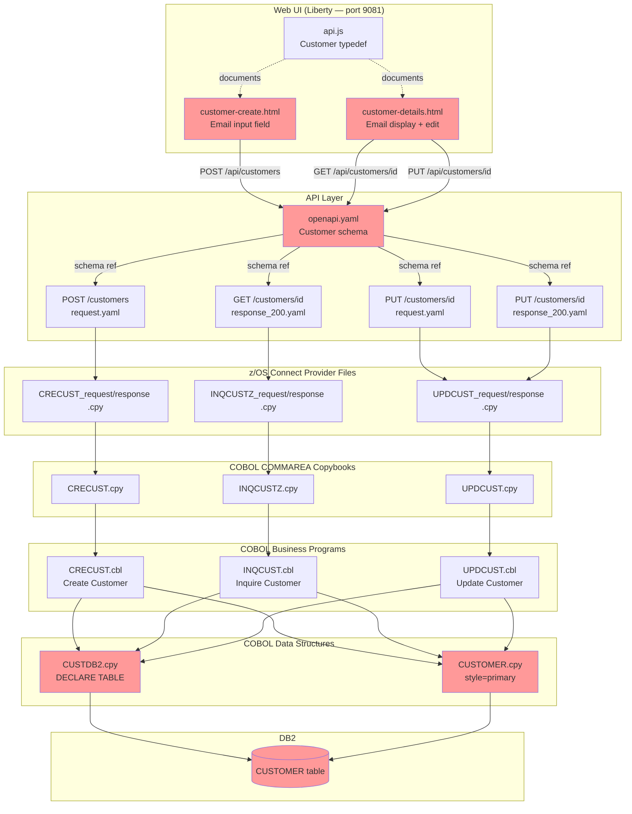
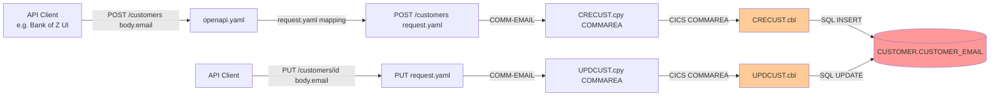
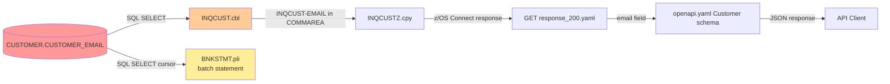
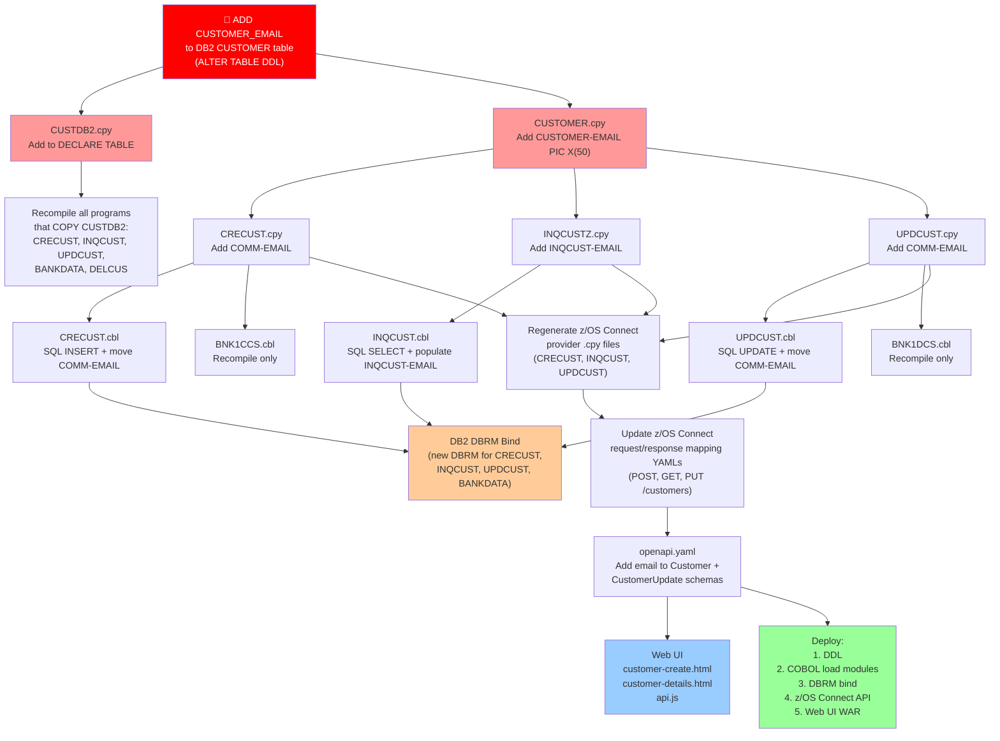

# Impact Analysis Report: Add Email Address Field to Customer Data Model

**Created**: 2026-07-27T22:54:50Z (revised)
**Author**: IBM Bob Premium Package for Z AI Assistant
**Analysis Method**: Z Understand + Local Workspace
**Workspace Alignment**: Fully Aligned
**Confidence Level**: High

---

> **Note:** This is a pre-captured output produced during a prior session. The actual output you see when running this prompt live may differ — the structure, wording, and level of detail can vary due to the non-deterministic nature of the large language models that Bob uses.

---

## 1. Change Summary

### Change Specification

**Title**: Add Email Address Field to Customer Data Model  
**Type**: Enhancement  
**Description**: Add a `CUSTOMER_EMAIL` column (CHAR(50)) to the `CUSTOMER` DB2 table and propagate the new field through all layers of the CICS processing path — COBOL copybooks, COBOL programs, BMS 3270 screens, CICS presentation programs, z/OS Connect COMMAREA definitions, z/OS Connect request/response mappings, the OpenAPI specification, and the WebSphere Liberty vanilla JavaScript Web UI.
**Business Objective**: Capture and expose customer email addresses to support digital communications, notifications, and API consumers.
**Scope Decision**: CICS path only. The IMS path uses a separate, smaller customer model (IMS DBD/PCB) that does not include comparable demographic fields and is out of scope for this change.
**DB2 Schema**: Owned by this team — DDL will be executed directly.

### System Context

**Key Technologies**: IBM Enterprise COBOL for z/OS, DB2 for z/OS, CICS, z/OS Connect, OpenAPI 3.0  
**Entry Points**: `CUSTOMER` DB2 table → `CUSTDB2.cpy` (DECLARE TABLE) → `CUSTOMER.cpy` (COBOL struct) → CICS business programs → COMMAREA copybooks → z/OS Connect zosAssets → OpenAPI schema  
**IMS Path**: No changes required (CICS-only scope confirmed)

---

## 2. Scope Definition

### In Scope

| Layer | Artifact | Change |
|---|---|---|
| DB2 schema | `CUSTOMER` table | Add `CUSTOMER_EMAIL CHAR(50)` column |
| COBOL struct copybook | `src/base/cics/copy/CUSTOMER.cpy` | Add `CUSTOMER-EMAIL PIC X(50)` |
| DB2 DECLARE TABLE copybook | `src/base/cics/copy/CUSTDB2.cpy` | Add `CUSTOMER_EMAIL CHAR(50)` to declaration |
| CICS COMMAREA — create | `src/base/cics/copy/CRECUST.cpy` | Add `COMM-EMAIL PIC X(50)` |
| CICS COMMAREA — inquire | `src/base/cics/copy/INQCUSTZ.cpy` | Add `INQCUST-EMAIL PIC X(50)` |
| CICS COMMAREA — update | `src/base/cics/copy/UPDCUST.cpy` | Add `COMM-EMAIL PIC X(50)` |
| CICS COMMAREA — delete | `src/base/cics/copy/DELCUS.cpy` | No change (delete uses customer number only) |
| COBOL business program | `src/base/cics/cobol/CRECUST.cbl` | Accept email in COMMAREA; include in SQL INSERT |
| COBOL business program | `src/base/cics/cobol/INQCUST.cbl` | Include email in SQL SELECT; return in COMMAREA |
| COBOL business program | `src/base/cics/cobol/UPDCUST.cbl` | Accept email in COMMAREA; include in SQL UPDATE |
| COBOL business program | `src/base/cics/cobol/DELCUS.cbl` | No change (delete by customer number) |
| COBOL data loader | `src/base/cics/cobol/BANKDATA.cbl` | Add email to test-data INSERT statements |
| PL/I batch program | `src/base/batch/pli/BNKSTMT.pli` | Optionally include email in statement output (see note) |
| **BMS map — create customer** | **`src/base/cics/bms/BNK1CCM.bms`** | **Add `EMAIL` DFHMDF field at row 21 (UNPROT, input)** |
| **BMS map — display customer** | **`src/base/cics/bms/BNK1DCM.bms`** | **Add `CUSTEML` DFHMDF field at row 20 (PROT, display)** |
| **CICS presentation program — create** | **`src/base/cics/cobol/BNK1CCS.cbl`** | **Add `SUBPGM-EMAIL PIC X(50)` to local SUBPGM-PARMS struct; read `EMAILI` from map; move to SUBPGM-EMAIL before LINK to CRECUST** |
| **CICS presentation program — display** | **`src/base/cics/cobol/BNK1DCS.cbl`** | **Add `COMM-EMAIL PIC X(50)` to inline DFHCOMMAREA LINKAGE and WS-COMM-AREA; display email from INQCUST response; pass email in UPDCUST COMMAREA** |
| z/OS Connect provider CPY — CRECUST | `src/api/src/main/zosAssets/CRECUST/providerFiles/gen/CRECUST_request_0.cpy` | Regenerate to include email |
| z/OS Connect provider CPY — CRECUST | `src/api/src/main/zosAssets/CRECUST/providerFiles/gen/CRECUST_response_0.cpy` | Regenerate to include email |
| z/OS Connect provider CPY — INQCUST | `src/api/src/main/zosAssets/INQCUST/providerFiles/gen/INQCUSTZ_request_0.cpy` | Regenerate to include email |
| z/OS Connect provider CPY — INQCUST | `src/api/src/main/zosAssets/INQCUST/providerFiles/gen/INQCUSTZ_response_0.cpy` | Regenerate to include email |
| z/OS Connect provider CPY — UPDCUST | `src/api/src/main/zosAssets/UPDCUST/providerFiles/gen/UPDCUST_request_0.cpy` | Regenerate to include email |
| z/OS Connect provider CPY — UPDCUST | `src/api/src/main/zosAssets/UPDCUST/providerFiles/gen/UPDCUST_response_0.cpy` | Regenerate to include email |
| z/OS Connect request mapping — POST /customers | `src/api/src/main/operations/%2Fcustomers/post/request.yaml` | Map `$body.email` → `COMM-EMAIL` |
| z/OS Connect response mapping — POST /customers | `src/api/src/main/operations/%2Fcustomers/post/response_201.yaml` | No change (returns only customerId + sortCode) |
| z/OS Connect request mapping — PUT /customers/{id} | `src/api/src/main/operations/%2Fcustomers%2F%7BcustomerId%7D/put/request.yaml` | Map `$body.email` → `COMM-EMAIL` |
| z/OS Connect response mapping — PUT /customers/{id} | `src/api/src/main/operations/%2Fcustomers%2F%7BcustomerId%7D/put/response_200.yaml` | Map `COMM-EMAIL` → `email` |
| z/OS Connect response mapping — GET /customers/{id} | `src/api/src/main/operations/%2Fcustomers%2F%7BcustomerId%7D/get/response_200.yaml` | Map `INQCUST-EMAIL` → `email` |
| OpenAPI specification | `src/api/src/main/api/openapi.yaml` | Add `email` field to `Customer` and `CustomerUpdate` schemas |
| **Web UI — Create Customer page** | **`src/frontend/customer-create.html`** | **Add optional email input field (`<cds-text-input>`, `maxlength=50`, `type=email`); include in POST body when non-empty** |
| **Web UI — Customer Details page** | **`src/frontend/customer-details.html`** | **Display email from GET response; allow edit and submit via PUT body; preserve existing email when field left blank** |
| **Web UI — API client JSDoc** | **`src/frontend/js/api.js`** | **Update `@typedef Customer` and `createCustomer` param docs to include `email` property** |
| **Web UI setup script** | **`.setup/jcl/cics/Db2-create.j2`** | **Add `CUSTOMER_EMAIL CHAR(50)` to `CREATE TABLE BANKZ.CUSTOMER` DDL (fresh installs)** |

### Out of Scope

| Artifact | Reason |
|---|---|
| All IMS path programs (`IBGCUDAT`, `IBSCUDAT`, `IBLOGIN`, `IBLOGIN1`, `IBLOGOUT`, `IBTRAN`) | IMS path uses a separate customer model — excluded by design decision |
| IMS z/OS Connect operations (`/ims/customers/*`) | IMS path excluded |
| IMS DBD/PSB Assembler sources | IMS path excluded |
| `DELCUS.cbl` / `DELCUS.cpy` | Delete operation works by customer number only; email is not involved |
| Credit agency stubs `CRDTAGY1`–`CRDTAGY5` | These only use `SORTCODE.cpy`; no customer data struct |
| `ABNDPROC.cbl` | Error handler; no customer data |

### System Boundaries

- **External boundary**: The Web UI (`src/frontend/`) is the outermost user-facing boundary — end users see the email field in `customer-create.html` and `customer-details.html`
- **API boundary**: The OpenAPI `Customer` schema exposed by z/OS Connect is the API consumer boundary — `email` is now part of the public contract
- **IMS boundary**: No change crosses into the IMS processing path
- **DB2 boundary**: Only the `CUSTOMER` table changes; `ACCOUNT`, `PROCTRAN`, and `STTESTER.CONTROL` are unaffected
- **Web UI routing**: The Web UI automatically routes to CICS endpoints for customer IDs starting with `C` — IMS endpoints (`/ims/customers/*`) are unaffected

---

## 3. System Overview

### System Context Diagram



**Legend**: 🔴 Red = primary change origin points that propagate to all other layers

---

## 4. Dependency Analysis

### The Customer Data Model — Current State

The customer data is represented by **three parallel structures** that must all be updated:

| Structure | File | Used for |
|---|---|---|
| `CUSTOMER-RECORD` (03 group) | `src/base/cics/copy/CUSTOMER.cpy` | Internal COBOL working storage in `CRECUST`, `INQCUST`, `UPDCUST` |
| `EXEC SQL DECLARE CUSTOMER TABLE` | `src/base/cics/copy/CUSTDB2.cpy` | Tells the DB2 pre-compiler the table shape — must match the real table |
| `COMM-*` / `INQCUST-*` COMMAREA fields | `CRECUST.cpy`, `INQCUSTZ.cpy`, `UPDCUST.cpy` | Data contract between z/OS Connect and each CICS business program |

All three are independent copybooks. A change to one does **not** automatically update the others — each must be edited explicitly.

### Upstream Dependencies (What feeds the email field in)



### Downstream Dependencies (What reads the email field out)



> ⚠️ **`BNKSTMT.pli` note**: The PL/I batch statement program selects from `CUSTOMER` via a DB2 cursor into the `HV_CUSTOMER` host variable structure. The `SELECT` statement currently uses specific column names (verified in source). Adding `CUSTOMER_EMAIL` to the table does **not** break `BNKSTMT` if the SELECT uses named columns and does not include `CUSTOMER_EMAIL`. However, if `BNKSTMT` is later enhanced to print email on statements, `HV_CUSTOMER` in `BNKSTMT.pli` must also gain a `HV_CUST_EMAIL CHAR(50)` member.

### Internal Dependencies — Copybook Usage by Program

| Copybook changed | Programs that COPY it | Action required |
|---|---|---|
| `CUSTOMER.cpy` | `CRECUST.cbl`, `INQCUST.cbl`, `UPDCUST.cbl`, `BANKDATA.cbl`, `DELCUS.cbl` | All must be recompiled; `CRECUST`, `INQCUST`, `UPDCUST` need SQL logic changes; `DELCUS` recompile only (no logic change); `BANKDATA` needs new email value in INSERT |
| `CUSTDB2.cpy` | `CRECUST.cbl`, `INQCUST.cbl`, `UPDCUST.cbl`, `BANKDATA.cbl`, `DELCUS.cbl` | Recompile all — the DB2 pre-compiler reads this declaration |
| `CRECUST.cpy` | `CRECUST.cbl`, `BNK1CCS.cbl` (CICS presentation layer) | `CRECUST.cbl` needs logic changes; `BNK1CCS.cbl` recompile only (passes COMMAREA through; does not inspect email) |
| `INQCUSTZ.cpy` | `INQCUST.cbl` | Logic change to populate `INQCUST-EMAIL` |
| `UPDCUST.cpy` | `UPDCUST.cbl`, `BNK1DCS.cbl` (CICS presentation layer) | `UPDCUST.cbl` needs logic changes; `BNK1DCS.cbl` recompile only |

---

## 5. Impact Analysis

### Code-Level Impact — Detailed Changes Required

#### 1. DB2 Schema — `CUSTOMER` table
**Impact**: Execute DDL  
```sql
ALTER TABLE CUSTOMER
  ADD COLUMN CUSTOMER_EMAIL CHAR(50);
```
Existing rows will have `CUSTOMER_EMAIL = NULL`. The column should be nullable (no NOT NULL constraint) to avoid breaking existing data.

---

#### 2. `src/base/cics/copy/CUSTDB2.cpy` — DB2 DECLARE TABLE
**Impact**: Add one line to the EXEC SQL DECLARE block.  
Add after `CUSTOMER_CS_REVIEW_DATE INTEGER )`:
```cobol
               CUSTOMER_EMAIL                 CHAR(50) )
```
*(Remove the closing `)` from the previous last line and add it after the new field.)*

---

#### 3. `src/base/cics/copy/CUSTOMER.cpy` — COBOL struct
**Impact**: Add one field **after `CUSTOMER-PHONE`** (before `CUSTOMER-ADDRESS`):
```cobol
               05 CUSTOMER-EMAIL                       PIC X(50).
```

> ⚠️ **Required position**: email must sit immediately after `CUSTOMER-PHONE PIC X(20)` so that the field order matches all COMMAREA copybooks and the DB2 column order in the SQL INSERT/SELECT statements.

---

#### 4. `src/base/cics/copy/CRECUST.cpy` — Create customer COMMAREA
**Impact**: Add after `COMM-PHONE` (before `COMM-ADDR`):
```cobol
           03 COMM-EMAIL                      PIC X(50).
```
This places email at byte offset 159 (immediately after `COMM-PHONE` which ends at byte 158). The address block, status, dates, credit score, and success flag all shift down by 50 bytes, but the total COMMAREA length remains **453 bytes** (email moves from the end to mid-structure; `COMM-SUCCESS` stays at byte 448).

---

#### 5. `src/base/cics/copy/INQCUSTZ.cpy` — Inquire customer COMMAREA
**Impact**: Add after `INQCUST-PHONE` (before the address group):
```cobol
           03 INQCUST-EMAIL                   PIC X(50).
```

---

#### 6. `src/base/cics/copy/UPDCUST.cpy` — Update customer COMMAREA
**Impact**: Add after `COMM-PHONE` (before `COMM-ADDR`):
```cobol
           03 COMM-EMAIL                      PIC X(50).
```

---

#### 7. `src/base/cics/cobol/CRECUST.cbl` — Create customer program
**Impact**: Two separate changes required:

**7a — SQL INSERT** (original plan):
- In WORKING-STORAGE: `CUSTOMER-EMAIL` is already available via `COPY CUSTOMER` (after copybook change)
- Move `COMM-EMAIL` → `CUSTOMER-EMAIL` before the INSERT
- Add `CUSTOMER_EMAIL` to the `INSERT INTO CUSTOMER` column list and `:CUSTOMER-EMAIL` to the VALUES list

**7b — ⚠️ CRITICAL (post-deployment bug fix, commit `ab395ed`): `WS-CHILD-DATA` inline struct**

`CRECUST.cbl` contains an inline manual copy of the customer record structure, `WS-CHILD-DATA` (WORKING-STORAGE lines ~260–292), used to receive credit-agency results back from async CICS containers. This struct was **not** updated with the email field because it does not use a `COPY` statement.

The async credit-check flow:
1. CRECUST PUT CONTAINERs the DFHCOMMAREA (453 bytes) to each of 5 credit agency child transactions (CRDTAGY1–5)
2. Each CRDTAGY stub GETs the container into `WS-CONT-IN` which is `COPY CUSTOMER` (447 bytes, correctly updated)
3. Each stub writes a random credit score and PUTs 447 bytes back into the container
4. CRECUST GETs the returned container into `WS-CHILD-DATA` using `FLENGTH(LENGTH OF WS-CHILD-DATA)`
5. Before the fix, `WS-CHILD-DATA` was 397 bytes (missing `WS-CHILD-EMAIL PIC X(50)`) — shorter than the 447-byte container
6. CICS GET CONTAINER returns **LENGERR** when FLENGTH < actual container length
7. CRECUST treats any non-NORMAL RESP from GET CONTAINER as fail-code `'E'`: `COMM-SUCCESS = 'N'`
8. z/OS Connect maps `COMM-SUCCESS = 'N'` → HTTP 400 "Invalid request parameters"

**Fix**: Added `05 WS-CHILD-EMAIL PIC X(50).` immediately after `WS-CHILD-CS-REVIEW-YEAR` and before `WS-CHILD-SUCCESS` in `WS-CHILD-DATA`. `WS-CHILD-DATA` is now 447 bytes — matching the CRDTAGY container size. CRDTAGY1–5 did not need recompilation; their `COPY CUSTOMER` already included the email field.

> ⚠️ **Root cause of runtime 400 error**: This was the reason `POST /customers` returned HTTP 400 after deployment even though the z/OS Connect provider files, COMMAREA copybooks, and SQL INSERT were all correct. `messages.log` showed no error because the failure occurred inside CRECUST after the CICS call had completed successfully (z/OS Connect received a well-formed response with `COMM-SUCCESS = 'N'`).

---

#### 8. `src/base/cics/cobol/INQCUST.cbl` — Inquire customer program
**Impact**:
- Add `CUSTOMER_EMAIL` to the `SELECT` column list in the `EXEC SQL SELECT` statement
- Move `CUSTOMER-EMAIL` → `INQCUST-EMAIL` in the COMMAREA response population

---

#### 9. `src/base/cics/cobol/UPDCUST.cbl` — Update customer program
**Impact**:
- Move `COMM-EMAIL` → `CUSTOMER-EMAIL` before the UPDATE
- Add `CUSTOMER_EMAIL = :CUSTOMER-EMAIL` to the `SET` clause in the `EXEC SQL UPDATE` statement

---

#### 10. `src/base/cics/cobol/BANKDATA.cbl` — Test data loader
**Impact**: Add `HV-CUSTOMER-EMAIL PIC X(50)` to the `HOST-CUSTOMER-ROW` host variable block. Populate with a test value before each INSERT. Use a host variable — **not a string literal** — to avoid triggering `detect-secrets`:
```cobol
03 HV-CUSTOMER-EMAIL          PIC X(50).
...
MOVE SPACES TO HV-CUSTOMER-EMAIL
MOVE 'test@bankofz.example.com' TO HV-CUSTOMER-EMAIL
```
Add `CUSTOMER_EMAIL` / `:HV-CUSTOMER-EMAIL` to the INSERT column and VALUES lists.

> ⚠️ **Materialised risk** (R8): Initial implementation used a string literal in VALUES — this caused `detect-secrets` RC=8. Fixed in commit `477c3b7`.

---

#### 11. `src/base/cics/cobol/DELCUS.cbl` — Delete customer program
**Impact**: Recompile only. `DELCUS` uses `COPY CUSTOMER` and `COPY CUSTDB2` but only operates by customer number. No logic change needed to the program itself.

> ⚠️ **Post-implementation correction**: `DELCUS.cpy` (the delete COMMAREA copybook) was also missing `COMM-EMAIL`. Although the DELETE operation does not use the email value, the deployed COBOL program uses the full COMMAREA layout — omitting the field caused a 50-byte size mismatch between CICS and z/OS Connect. `DELCUS.cpy` was corrected in commit `f962ace`.

---

#### 12. z/OS Connect provider files — ✅ Manually fixed (commit `f962ace`)

The files under `src/api/src/main/zosAssets/*/providerFiles/gen/` describe the COMMAREA layout to z/OS Connect. All four provider file sets (CRECUST, INQCUST, UPDCUST, DELCUS) were missing the email field, causing COMMAREA size mismatches that resulted in HTTP 500 errors on every customer operation. These were manually corrected rather than regenerated via CLI.

> ⚠️ **The `gen/` files are NOT regenerated by the deployment pipeline.** Investigation of all scripts in `.setup/` confirmed that none of `pipeline-common.sh`, `task-dbb-build.sh`, `task-wazi-deploy.sh`, or `setup-zosconnect-server.sh` invoke the z/OS Connect CLI. The Gradle `com.ibm.zosconnect.gradle` plugin packages the existing `gen/` files from disk into the WAR without regenerating them. The `gen/` files committed in git are the single source of truth that feeds the build — they must be manually kept in sync with COMMAREA changes and committed before each WAR rebuild.

Files fixed per program:

| Program | Files fixed | Bytes before → after |
|---|---|---|
| CRECUST | `COMMAREA.cpy`, `gen/*_request_0.cpy`, `gen/*_response_0.cpy`, `request.dai`, `response.dai`, `gen/requestSchema.json`, `gen/responseSchema.json` | 403 → 453 |
| INQCUST | `gen/*_request_0.cpy`, `gen/*_response_0.cpy`, `request.dai`, `response.dai`, `gen/requestSchema.json`, `gen/responseSchema.json` | 403 → 457 |
| UPDCUST | `gen/*_request_0.cpy`, `gen/*_response_0.cpy`, `request.dai`, `response.dai`, `gen/requestSchema.json`, `gen/responseSchema.json` | 399 → 449 |
| DELCUS | `gen/*_request_0.cpy`, `gen/*_response_0.cpy`, `request.dai`, `response.dai`, `gen/requestSchema.json`, `gen/responseSchema.json` | 399 → 449 |

> **Recommended**: After z/OS deploy, use the z/OS Connect CLI to regenerate `gen/` files from the live deployed COMMAREA to produce the authoritative version, then commit back to git. The manual fixes are byte-accurate but CLI regeneration is the canonical process.

---

#### 13. z/OS Connect request/response mapping YAMLs

**`POST /customers` — `request.yaml`**: Add mapping:
```yaml
        - COMM-EMAIL:
            required: false
            nullable: true
            template: "{{$body.email}}"
```

**`PUT /customers/{id}` — `request.yaml`**: Add mapping:
```yaml
        - COMM-EMAIL:
            required: false
            nullable: true
            template: "{{$body.email}}"
```

**`GET /customers/{id}` — `response_200.yaml`**: Add mapping:
```yaml
    - email:
        required: false
        nullable: true
        template: "{{$zosAssetResponse.commarea.INQCUSTZ.\"INQCUST-EMAIL\"}}"
```

**`PUT /customers/{id}` — `response_200.yaml`**: Add mapping:
```yaml
    - email:
        required: false
        nullable: true
        template: "{{$zosAssetResponse.commarea.UPDCUST.\"COMM-EMAIL\"}}"
```

---

#### 14. `src/api/src/main/api/openapi.yaml` — OpenAPI schema
Add `email` to **three** component schemas: `Customer`, `CustomerUpdate`, and `CreateCustomerRequest`:
```yaml
      email:
        type: string
        maxLength: 50
        nullable: true
        description: Customer email address
        example: "customer@example.com"
```

> ⚠️ All three schemas must include `email`. Missing it from `CreateCustomerRequest` causes z/OS Connect to not forward the field from the request body to the mapping engine, so `COMM-EMAIL` receives an empty string even when the UI sends a value. Fixed in commit `183edf0`.

---

### Application-Level Impact

#### COMMAREA size change and field position
Each of the three COMMAREA copybooks (`CRECUST.cpy`, `INQCUSTZ.cpy`, `UPDCUST.cpy`) grows by 50 bytes. Email is placed **after `COMM-PHONE`** (byte 159), shifting the address block and all subsequent fields by 50 bytes. `COMM-SUCCESS` and `COMM-FAIL-CODE` remain at bytes 448–449 (unchanged final position). CICS COMMAREA length is specified in `EXEC CICS LINK` / `EXEC CICS RETURN` calls in the calling programs — confirm they use `LENGTH OF DFHCOMMAREA` dynamically rather than hard-coded lengths.

**CRECUST COMMAREA byte layout (453 bytes total) with email after phone:**

| Field | Start | Len |
|---|---|---|
| `COMM-EYECATCHER` | 1 | 4 |
| `COMM-KEY` (SORTCODE + NUMBER) | 5 | 16 |
| `COMM-NAME` (TITLE + FIRST + LAST) | 21 | 110 |
| `COMM-DOB` (DAY + MONTH + YEAR) | 131 | 8 |
| `COMM-PHONE` | 139 | 20 |
| **`COMM-EMAIL`** ← new | **159** | **50** |
| `COMM-ADDR` (LINE1+LINE2+CITY+POSTCODE+COUNTRY) | 209 | 210 |
| `COMM-STATUS` | 419 | 10 |
| `COMM-CREATED-DATE` | 429 | 8 |
| `COMM-CREDIT-SCORE` | 437 | 3 |
| `COMM-CS-REVIEW-DATE` | 440 | 8 |
| `COMM-SUCCESS` | 448 | 1 |
| `COMM-FAIL-CODE` | 449 | 1 |

#### 15. Web UI — `src/frontend/` (3 files)

**`customer-create.html`**:
- Add `<cds-text-input id="email" label="Email address" placeholder="Enter email address" maxlength="50" type="email">` after the Country field
- Extend `validateCustomerData` with a 50-character max-length check for email
- Include `email` in the POST request body as `email || undefined` — field is omitted entirely when blank (sends no key, not an empty string)

**`customer-details.html`**:
- Add email `<cds-text-input>` to `displayCustomerDetails` form, pre-populated from `customer.email` returned by `GET /customers/{id}`
- In `updateCustomer`, read the email field and include in PUT body only when non-empty — existing email is **preserved** (not overwritten) if the field is left blank

**`src/frontend/js/api.js`**:
- Update `@typedef Customer` JSDoc to include `email` property (`string`, max 50 chars, optional)
- Update `createCustomer` parameter documentation to include `email`

**Dependency**: Workstream G (Web UI) depends only on the OpenAPI `email` field being defined (F8). It does not require z/OS deployment and can be developed in parallel with all z/OS workstreams.

---

#### Programs requiring recompile (all CICS path)

| Program | Logic change? | Reason |
|---|---|---|
| `CRECUST.cbl` | ✅ Yes | SQL INSERT + COMMAREA |
| `INQCUST.cbl` | ✅ Yes | SQL SELECT + COMMAREA |
| `UPDCUST.cbl` | ✅ Yes | SQL UPDATE + COMMAREA |
| `BANKDATA.cbl` | ✅ Yes | Test data INSERT (use host variable — not literal) |
| `DELCUS.cbl` | ❌ Recompile only | Uses `COPY CUSTDB2` — `DELCUS.cpy` COMMAREA also required email field (post-deployment correction) |
| `BNK1CCS.cbl` | ✅ Yes | Reads `EMAILI` from BMS map; wires to SUBPGM-EMAIL |
| `BNK1DCS.cbl` | ✅ Yes ⚠️ | Inline LINKAGE + WS-COMM-AREA extended; display + update paths wired |

#### Web UI files changed

| File | Nature | Dependency |
|---|---|---|
| `src/frontend/customer-create.html` | Feature addition | OpenAPI `email` field (F8) |
| `src/frontend/customer-details.html` | Feature addition | OpenAPI `email` field (F8) |
| `src/frontend/js/api.js` | JSDoc update | None |
| `.setup/jcl/cics/Db2-create.j2` | DDL fix | Setup/install only |

#### DB2 DBRM bind
After recompiling `CRECUST`, `INQCUST`, `UPDCUST`, and `BANKDATA`, new DBRMs are produced. These must be bound into the DB2 plan before the programs can run. This is part of the normal DBB pipeline.

---

### System-Level Impact

#### z/OS Connect API contract change
The `Customer` schema in `openapi.yaml` gains an optional `email` field. This is a **backward-compatible additive change** — existing API consumers that ignore unknown fields are unaffected. Consumers that validate strictly against the schema must update their validation.

#### Web UI impact
The Web UI (`src/frontend/`) is a vanilla JavaScript application served from a WebSphere Liberty server (port 9081) separate from z/OS Connect (port 9080). Changes are purely frontend — no Liberty server restart is needed; Wazi Deploy deploys the WAR file and Liberty picks it up. The Web UI uses `config.js` for API base URL detection (port 3001 → Docker dev proxy; other → direct z/OS Connect on port 9080). CICS vs IMS routing is determined by the leading letter of the customer ID — IMS pages are unaffected.

#### `BNKSTMT.pli` — Batch monthly statement
The PL/I SELECT uses named columns (`HV_CUST_*`). Adding `CUSTOMER_EMAIL` to the table does not affect existing queries that do not reference it. **No change to `BNKSTMT.pli` is required for this scope.** If email is desired on printed statements in future, `BNKSTMT.pli` and its host variable struct (`HV_CUSTOMER`) would need a separate change.

---

## 6. Change Propagation Map



### Deployment Sequence (order is critical)

1. **DB2 DDL** — `ALTER TABLE CUSTOMER ADD COLUMN CUSTOMER_EMAIL CHAR(50)` (existing installs only; fresh installs use `Db2-create.j2` which now includes the column)
2. **Update `gen/` provider files in source** — manually update all affected `gen/` copybooks, `.dai` files, and JSON schemas in source control before building (the pipeline does NOT regenerate these automatically — see section 12)
3. **Build COBOL programs** — DBB impact build picks up copybook changes automatically via `dbb-app.yaml` dependency patterns
4. **DB2 DBRM bind** — bind new DBRMs for `CRECUST`, `INQCUST`, `UPDCUST`, `BANKDATA` into the DB2 plan
5. **Build and deploy z/OS Connect WAR** — `dbb build impact` for the API project; Wazi Deploy deploys the updated WAR (which now contains the corrected `gen/` files)
6. **Build and deploy Web UI WAR** — `dbb build impact` packages `bank-frontend-vanilla.war`; Wazi Deploy copies it to `${frontend_root}/servers/bankz-frontend/apps/`
7. **(Optional, post-deploy)** — Run z/OS Connect CLI to regenerate `gen/` files from the live deployed COMMAREA; commit back to git as the authoritative version

> ⚠️ **Critical ordering**: Steps 1 (DDL) and 4 (DBRM bind) must complete before running any program that accesses `CUSTOMER_EMAIL`. Step 2 (update `gen/` files in source) must complete before step 5 (build WAR) — the pipeline packages whatever is on disk.

---

## 7. Risk Assessment

| ID | Risk | Category | Likelihood | Impact | Level | Mitigation |
|---|---|---|---|---|---|---|
| R1 | **`BNK1DCS.cbl` inline `DFHCOMMAREA` LINKAGE (lines 191–212) and `WS-COMM-AREA` (lines 128–150) are hard-coded field-by-field — NOT COPY statements — and will silently corrupt all customer data if not manually extended** | Regression | **High** | **High** | **CRITICAL** | Manually add `COMM-EMAIL PIC X(50)` to LINKAGE and `WS-COMM-EMAIL PIC X(50)` to WS-COMM-AREA; add display and update logic |
| R1b | BMS reassembly must precede `BNK1CCS`/`BNK1DCS` recompile — if order is wrong, compile fails on undefined map field names | Build Failure | Medium | Medium | **MEDIUM** | DBB `dbb-app.yaml` `.bms` dependency pattern handles this; verify in build log |
| R2 | DBRM bind forgotten or run before DDL — programs abend with SQL -204 (object not found) | Runtime Failure | Medium | High | **HIGH** | Enforce deployment sequence; test in non-prod first |
| R3 | z/OS Connect `gen/` files not updated when COMMAREA changes — **the deployment pipeline never regenerates them automatically**; stale `gen/` files are packaged into the WAR verbatim, causing COMMAREA size mismatches and HTTP 500/400 errors | Data Integrity | **High** | **High** | **CRITICAL** | **Materialised** — fixed in `f962ace`. `gen/` files must be manually updated in source control before each WAR build. CLI regeneration after deploy is the canonical process but must be followed by a commit + rebuild. |
| R4 | Existing CUSTOMER rows have NULL email — programs that move `CUSTOMER-EMAIL` to display fields may show blanks or SPACES rather than fail, but callers must handle null/blank gracefully | Data Integrity | High | Low | **MEDIUM** | Ensure no NOT NULL constraint on `CUSTOMER_EMAIL`; verify COBOL programs initialise the field to SPACES before SELECT |
| R5 | `BANKDATA.cbl` INSERT fails if email column added to table but not to the INSERT column list | Runtime Failure | High | Medium | **MEDIUM** | Update `BANKDATA` INSERT simultaneously with DDL deployment |
| R6 | OpenAPI schema change breaks strict-validation API consumers | Integration | Low | Medium | **LOW** | Email field is optional (`required: false`, nullable); additive — backward compatible for lenient consumers |
| R7 | `BNKSTMT.pli` SELECT uses `SELECT *` style — verify it uses named columns | Data Integrity | Low | Low | **LOW** | Confirmed: `BNKSTMT.pli` uses named columns in SELECT (verified in source); no risk |
| R8 | String literal in `BANKDATA.cbl` VALUES clause triggers `detect-secrets` RC=8 | Build Failure | High | Medium | **MEDIUM** | **Materialised** — fixed commit `477c3b7`: use host variable `:HV-CUSTOMER-EMAIL` |
| R9 | `END-EXEC.` indentation shift in `CUSTDB2.cpy` to Area A (col 11) — RC=8 in all 4 including programs | Build Failure | High | High | **HIGH** | **Materialised** — fixed commit `f0da907`: restored to Area B (col 12) |
| R10 | `Db2-create.j2` `CREATE TABLE` missing `CUSTOMER_EMAIL` — fresh installs create table without new column; `BANKDATA` fails with SQLCODE -206 | Runtime Failure | Medium | High | **HIGH** | **Materialised** — fixed commit `399a02e`: added column to DDL template |

### Critical Risk Detail — R1: COMMAREA length

The presentation-layer programs `BNK1CCS.cbl` (create customer) and `BNK1DCS.cbl` (delete customer — actually update customer screen) pass the COMMAREA to `CRECUST` and `UPDCUST` respectively via `EXEC CICS LINK PROGRAM(...) COMMAREA(...) LENGTH(...)`. If `LENGTH` is specified as a numeric literal rather than `LENGTH OF DFHCOMMAREA`, the truncated COMMAREA will silently drop the new email field. This must be verified before implementation.

---

## 8. Assumptions and Unknowns

| # | Assumption / Unknown | Status |
|---|---|---|
| A1 | `BNK1CCS.cbl` and `BNK1DCS.cbl` use dynamic COMMAREA length (`LENGTH OF DFHCOMMAREA`) | **Assumed — verify before implementing** |
| A2 | No other application (e.g. Data Warehouse, external ETL) reads the `CUSTOMER` table directly and will break on a new nullable column | Confirmed by user (CICS team owns DB2 schema) |
| A3 | Email field is optional (nullable) — not required for existing customer records | Confirmed — user approved nullable column |
| A4 | The z/OS Connect API `Customer` schema is defined in `openapi.yaml` under `components/schemas/Customer` | Confirmed from file inspection |
| A5 | `BNKSTMT.pli` batch does not need to output email on statements in this scope | Confirmed by user (CICS-only, no batch requirement stated) |
| A6 | Web UI is vanilla JavaScript with no build step — files are packaged into a WAR by `VanillaFrontend.groovy` DBB task and deployed to a separate Liberty server on port 9081 | Confirmed from `dbb-app.yaml` and `VanillaFrontend.groovy` inspection |
| A7 | Web UI `config.js` detects the z/OS Connect API URL at runtime — port 3001 → Docker dev proxy; all other ports → direct z/OS Connect on port 9080 | Confirmed from `src/frontend/config.js` inspection |
| A8 | IMS customer pages (`/ims/customers/*`) in the Web UI are unaffected — routing is based on customer ID prefix (`I` = IMS, `C` = CICS) | Confirmed from `api.js` `getSystemFromCustomerId()` function |

---

## 9. Effort Estimate

| Work Item | Effort |
|---|---|
| DB2 DDL | < 0.5 day |
| COBOL copybook edits (6 files × simple additions) | 0.5 day |
| COBOL program logic changes (`CRECUST`, `INQCUST`, `UPDCUST`, `BANKDATA`) | 1–2 days |
| BMS map updates (`BNK1CCM.bms`, `BNK1DCM.bms`) | 0.25 day |
| CICS presentation program changes (`BNK1CCS.cbl`, `BNK1DCS.cbl`) | 0.5–1 day |
| z/OS Connect provider file regeneration | 0.5 day |
| z/OS Connect mapping YAML updates (4 files) | 0.5 day |
| OpenAPI schema update | 0.25 day |
| Web UI changes (3 files) | 0.5 day |
| DBB build + DBRM bind + deployment | 0.5 day |
| Testing (unit + integration + API + Web UI) | 1–2 days |
| **Total** | **~6–8 days** |

---

## 10. Recommended Next Steps

1. **Verify COMMAREA lengths** in `BNK1CCS.cbl` and `BNK1DCS.cbl` (Risk R1 — highest priority gate)
2. **Create implementation plan** using the component list in Section 5 as the work breakdown
3. **Execute DB2 DDL** in non-production first; verify existing programs still run with new nullable column
4. **Implement copybook changes** in the order: `CUSTDB2.cpy` → `CUSTOMER.cpy` → COMMAREA copybooks — place `CUSTOMER-EMAIL` / `COMM-EMAIL` **after the phone field** in every copybook
5. **Implement COBOL program changes** for `CRECUST`, `INQCUST`, `UPDCUST`, `BANKDATA` — SQL INSERT/SELECT column order must match the DB2 table column order
6. **Update all `gen/` provider files in source control** — adjust `startPos` values for all fields that follow `COMM-EMAIL` in each `.dai` and `_0.cpy` file; do this before building the WAR
7. **Run DBB impact build** — the `impactQueryPatterns` in `dbb-app.yaml` will automatically detect all programs affected by the copybook changes
8. **Update mapping YAMLs and OpenAPI spec**
9. **Deploy in sequence** per Section 6 deployment order

---

## 11. Post-Implementation Findings

Five issues were discovered during deployment and testing after the initial implementation:

| # | Finding | Root Cause | Resolution | Commit |
|---|---|---|---|---|
| F1 | `detect-secrets` blocked commit — RC=8 on `BANKDATA.cbl` | String literal `'test@bankofz.example.com'` in SQL VALUES clause flagged as potential credential | Use host variable `HV-CUSTOMER-EMAIL` instead of literal | `477c3b7` |
| F2 | RC=8 compile on `CRECUST`, `INQCUST`, `UPDCUST`, `DELCUS` | `END-EXEC.` in `CUSTDB2.cpy` shifted to COBOL Area A (col 11) during edit — syntax error in all programs that INCLUDE CUSTDB2 | Restore `END-EXEC.` to column 12 (Area B) | `f0da907` |
| F3 | SQLCODE -206 ("column does not exist") running `BANKDATA` after populate | `.setup/jcl/cics/Db2-create.j2` `CREATE TABLE` statement did not include `CUSTOMER_EMAIL` — existing install required `ALTER TABLE`; fresh install would create table without column | Added `CUSTOMER_EMAIL CHAR(50)` to `CREATE TABLE` in `Db2-create.j2`; existing installs still need `ALTER TABLE CUSTOMER ADD COLUMN CUSTOMER_EMAIL CHAR(50)` | `399a02e` |
| F4 | HTTP 500 on all customer API calls (Create, Display, Update, Delete) | All z/OS Connect provider file sets (`gen/` copybooks, `.dai` descriptors, JSON schemas) were missing the email field — COMMAREA size mismatch between z/OS Connect (stale, pre-email size) and deployed CICS programs (email-aware size) | Manually corrected all 26 affected files across CRECUST, INQCUST, UPDCUST, DELCUS; also corrected missing `COMM-EMAIL` in `DELCUS.cpy` | `f962ace` |
| F5 | HTTP 400 "Invalid request parameters" on `POST /customers` after all provider files were fixed | `WS-CHILD-DATA` inline struct in `CRECUST.cbl` was missing `WS-CHILD-EMAIL PIC X(50)`. The CRDTAGY1–5 credit-agency stubs write 447-byte containers (using updated `COPY CUSTOMER`). CRECUST GETs those containers into `WS-CHILD-DATA` using `LENGTH OF WS-CHILD-DATA` = 397 bytes — CICS returns LENGERR, CRECUST sets `COMM-SUCCESS = 'N'`, fail-code `'E'` | Added `05 WS-CHILD-EMAIL PIC X(50).` to `WS-CHILD-DATA` after `WS-CHILD-CS-REVIEW-YEAR`, before `WS-CHILD-SUCCESS` | `ab395ed` |
| F6 | HTTP 400 also triggered when `email` field present in `POST /customers` request body | `CreateCustomerRequest` schema in `openapi.yaml` was missing the `email` property — only `Customer` and `CustomerUpdate` had it; z/OS Connect schema validation may strip unknown fields | Added `email` (string, maxLength 50, nullable) to `CreateCustomerRequest` in `openapi.yaml` | `183edf0` |
