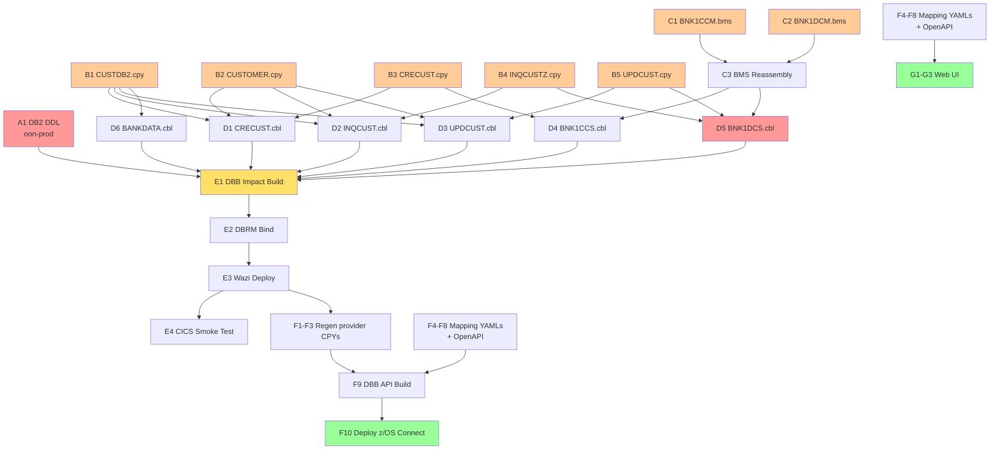

# Implementation Plan: Add Email Address Field to Customer Data Model

**Created**: 2026-07-27T23:00:00Z  
**Author**: IBM Bob Premium Package for Z AI Assistant  
**Analysis Method**: Z Understand + Local Workspace  
**Workspace Alignment**: Fully Aligned  
**Data Dictionary Coverage**: Not required (field additions only)  
**Reference**: `bobz/add-email/impact-analysis.md`

---

> **Note:** This is a pre-captured output produced during a prior session. The actual output you see when running this prompt live may differ — the structure, wording, and level of detail can vary due to the non-deterministic nature of the large language models that Bob uses.

---

## 1. Executive Summary

Add a 50-character email address field (`CUSTOMER_EMAIL`) to the Bank of Z CICS customer data
model end-to-end: DB2 schema, COBOL copybooks, CICS business programs, BMS 3270 screens,
CICS presentation programs, z/OS Connect provider files, request/response mapping YAMLs,
the OpenAPI specification, and the WebSphere Liberty Web UI.

**Business Value**: Enables customer email capture and downstream digital communications across
all CICS customer operations — create, inquire, and update.

**Key Risks**:
1. `BNK1DCS.cbl` has a **hard-coded inline `DFHCOMMAREA` LINKAGE SECTION** (not a COPY
   statement) — it will silently corrupt customer data if not manually extended before recompile.
2. BMS reassembly must complete before `BNK1CCS`/`BNK1DCS` can be compiled — build ordering
   must be verified.
3. z/OS Connect provider `.cpy` files must be **regenerated**, never hand-edited.

**IMS path**: Not in scope (confirmed). No IMS programs, DBDs, PSBs, or IMS z/OS Connect
operations change.

---

## 2. Prerequisites

- DB2 DDL execution rights on the `CUSTOMER` table (confirmed — team owns schema)  
- z/OS Connect CLI available on USS to regenerate provider `.cpy` files  
- All work to be committed with `git commit -s` (DCO sign-off mandatory)

---

## 3. Requirements

### Functional Requirements
- **FR1**: The `CUSTOMER` DB2 table stores a nullable email address field (`CUSTOMER_EMAIL CHAR(50)`)
- **FR2**: `CRECUST` (Create Customer) accepts and persists email via COMMAREA and SQL INSERT
- **FR3**: `INQCUST` (Inquire Customer) retrieves and returns email via COMMAREA and SQL SELECT
- **FR4**: `UPDCUST` (Update Customer) accepts and persists email via COMMAREA and SQL UPDATE
- **FR5**: The BNK1CCM Create Customer 3270 screen presents an email input field (UNPROT) at row 21
- **FR6**: The BNK1DCM Display Customer 3270 screen presents an email display field (PROT) at row 20
- **FR7**: `BNK1CCS` reads the email from the BMS map and passes it to `CRECUST`
- **FR8**: `BNK1DCS` displays email from the `INQCUST` response and passes email in the `UPDCUST` COMMAREA
- **FR9**: The `GET /customers/{id}`, `POST /customers`, and `PUT /customers/{id}` z/OS Connect
  operations expose the email field
- **FR10**: The OpenAPI `Customer` and `CustomerUpdate` schemas include an optional `email` field
- **FR11**: The Web UI Create Customer page (`customer-create.html`) presents an optional email input field and submits it in the POST request body
- **FR12**: The Web UI Customer Details page (`customer-details.html`) displays the email address returned by the API and allows the user to edit and submit an updated email via PUT

### Non-Functional Requirements
- **NFR1**: `CUSTOMER_EMAIL` column is nullable — no NOT NULL constraint — to preserve all existing rows
- **NFR2**: Email field is optional at all API boundaries (`required: false`, nullable)
- **NFR3**: BMS field length: 50 characters, matching the DB2 column and COBOL PIC X(50)
- **NFR4**: DB2 DBRM bind must follow DDL — programs must not run against new column until bind completes
- **NFR5**: Web UI email field is optional (no `required` attribute), `maxlength="50"`, `type="email"` for browser-side format hint; not sent in request body when empty

### Business Requirements
- **BR1**: All CICS customer operations (create/inquire/update) are consistent — email is present
  in all three COMMAREA copybooks
- **BR2**: Existing customers with no email (NULL) must continue to function — COBOL programs
  INITIALIZE or move SPACES before SELECT to avoid uninitialized field issues

---

## 4. Goals and Non-Goals

### Goals
1. Add `CUSTOMER_EMAIL CHAR(50)` nullable column to the `CUSTOMER` DB2 table
2. Update all COBOL copybooks that define the customer data structure or COMMAREA
3. Add SQL column to INSERT, SELECT (named columns), and UPDATE statements in business programs
4. Add BMS input field to `BNK1CCM.bms` (Create screen) and display field to `BNK1DCM.bms`
5. Extend `BNK1CCS.cbl` to read email from map and pass to `CRECUST`
6. Extend `BNK1DCS.cbl` (inline DFHCOMMAREA and WS-COMM-AREA) to carry, display, and update email
7. Regenerate z/OS Connect provider `.cpy` files for CRECUST, INQCUST, UPDCUST
8. Update z/OS Connect request/response mapping YAMLs for POST, GET, PUT /customers
9. Add `email` field to OpenAPI `Customer` and `CustomerUpdate` schemas
10. Update the Web UI Create Customer page to capture and submit email
11. Update the Web UI Customer Details page to display and update email

### Non-Goals
1. Any changes to the IMS processing path
2. Server-side email format validation (regex checking) — the Web UI uses `type="email"` as a browser hint only; the COBOL backend stores whatever is passed
3. Changes to the `DELCUS` delete operation (email not involved)
4. Changes to `BNKSTMT.pli` batch (SELECT uses named columns; no statement email requirement)
5. Changes to BMS screens other than BNK1CCM and BNK1DCM
6. Changes to IMS Web UI pages (`/ims/customers/…`) — email is CICS-only
7. Changes to account or transaction Web UI pages (`account-*.html`, `transaction-*.html`) — email is customer-level only

---

## 5. Current State Analysis

### Key Source Structure (confirmed by file inspection)

| Artifact | Location | Current state |
|---|---|---|
| DB2 DECLARE TABLE | `src/base/cics/copy/CUSTDB2.cpy` | 17 columns, no email |
| COBOL customer struct | `src/base/cics/copy/CUSTOMER.cpy` | `03 CUSTOMER-RECORD`, ends at `CUSTOMER-CS-REVIEW-DATE` group |
| Create COMMAREA | `src/base/cics/copy/CRECUST.cpy` | `COMM-EMAIL PIC X(50)` currently at end, before `COMM-SUCCESS` / `COMM-FAIL-CODE` — **must move to after `COMM-PHONE`** |
| Inquire COMMAREA | `src/base/cics/copy/INQCUSTZ.cpy` | `INQCUST-EMAIL PIC X(50)` currently at end, before success/fail/PCB fields — **must move to after phone field** |
| Update COMMAREA | `src/base/cics/copy/UPDCUST.cpy` | `COMM-EMAIL PIC X(50)` currently at end, before `COMM-UPD-SUCCESS` / `COMM-UPD-FAIL-CD` — **must move to after `COMM-PHONE`** |
| Create screen | `src/base/cics/bms/BNK1CCM.bms` | Last data row 20; rows 21-22 empty; row 23 MESSAGE; row 24 PF keys |
| Display screen | `src/base/cics/bms/BNK1DCM.bms` | Last data row 19; rows 20-22 empty; row 23 MESSAGE; row 24 PF keys |
| Create presenter | `src/base/cics/cobol/BNK1CCS.cbl` | Has local `SUBPGM-PARMS` struct (not COPY CRECUST); COPY BNK1CCM for map |
| Display presenter | `src/base/cics/cobol/BNK1DCS.cbl` | **Inline DFHCOMMAREA LINKAGE (lines 191–212) and WS-COMM-AREA (lines 128–150) — NOT a COPY** |
| z/OS Connect provider CPYs | `src/api/src/main/zosAssets/*/providerFiles/gen/` | Auto-generated; must not be hand-edited |

### Assumptions
- `BNK1CCS` uses `LENGTH OF SUBPGM-PARMS` (not a literal) in its `EXEC CICS LINK` to `CRECUST`
- `INQCUST` SELECT already uses named columns (not `SELECT *`) — confirmed by ZCodeScan rule
- DB2 plan can be re-bound by the team after recompile

---

## 6. Workstreams and Execution Sequence

### Workstream A — DB2 Schema
**Purpose**: Add the new column to the database before any program tries to use it.

| Step | Task |
|---|---|
| A1 | Execute `ALTER TABLE CUSTOMER ADD COLUMN CUSTOMER_EMAIL CHAR(50)` in non-production |
| A2 | Verify existing programs still run with the new nullable column (no regression from DDL alone) |
| A3 | Execute same DDL in production at deployment time |

**Dependency**: Must precede DB2 DBRM bind (Step E1).

---

### Workstream B — COBOL Copybooks (6 files)
**Purpose**: Update all data structures that define the customer model. These changes trigger
the DBB impact scanner to automatically pick up all downstream COBOL recompiles.

| Step | Task | File | Change |
|---|---|---|---|
| B1 | Add to DB2 DECLARE TABLE | `src/base/cics/copy/CUSTDB2.cpy` | Add `CUSTOMER_EMAIL CHAR(50)` — remove `)` after last column, add new column then `)` |
| B2 | Add to COBOL customer struct | `src/base/cics/copy/CUSTOMER.cpy` | Move/add `05 CUSTOMER-EMAIL PIC X(50)` **after `CUSTOMER-PHONE` group** (before `CUSTOMER-ADDR` group) |
| B3 | Add to Create COMMAREA | `src/base/cics/copy/CRECUST.cpy` | Move/add `03 COMM-EMAIL PIC X(50)` **after `COMM-PHONE` field** (before `COMM-ADDR-LINE1`) |
| B4 | Add to Inquire COMMAREA | `src/base/cics/copy/INQCUSTZ.cpy` | Move/add `03 INQCUST-EMAIL PIC X(50)` **after phone field** (before address fields) |
| B5 | Add to Update COMMAREA | `src/base/cics/copy/UPDCUST.cpy` | Move/add `03 COMM-EMAIL PIC X(50)` **after `COMM-PHONE` field** (before address fields) |
| B6 | Add to Delete COMMAREA | `src/base/cics/copy/DELCUS.cpy` | Move/add `03 COMM-EMAIL PIC X(50)` **after `COMM-PHONE` field** (before address fields) — initially assessed as skip; corrected post-deployment |

**Dependency**: B1–B5 can be done in parallel. Must complete before Workstream D.

---

### Workstream C — BMS Screen Maps (2 files + reassembly)
**Purpose**: Add the email field to the 3270 terminal screens. BMS reassembly must run before
`BNK1CCS` and `BNK1DCS` can be compiled, because those programs COPY the generated symbolic map.

| Step | Task | File | Change |
|---|---|---|---|
| C1 | Add email input field | `src/base/cics/bms/BNK1CCM.bms` | Insert new DFHMDF block at row 21 (see spec below) |
| C2 | Add email display field | `src/base/cics/bms/BNK1DCM.bms` | Insert new DFHMDF block at row 20 (see spec below) |
| C3 | BMS reassembly | DBB BMS task | Run `dbb build impact` — reassembles `.bms` → generates updated `BNK1CC` / `BNK1DC` symbolic map copybooks in `HLQ.BMS.COPY` |

#### C1 — BNK1CCM.bms new field (insert after DOBYY block, before Sort Code label at row 17)
Insert these lines before the `Sort Code` label (`DFHMDF POS=(17,1)`):
```hlasm
         DFHMDF POS=(21,1),LENGTH=16,ATTRB=(NORM,PROT),              *
               COLOR=NEUTRAL,INITIAL=' Email Address  '
EMAIL    DFHMDF POS=(21,18),LENGTH=50,ATTRB=(UNPROT,FSET,NORM),      *
               COLOR=GREEN,HILIGHT=UNDERLINE
         DFHMDF POS=(21,69),LENGTH=0,ATTRB=(PROT,ASKIP),COLOR=GREEN
```
Result: map generates `EMAILL`, `EMAILF`, `EMAILA`, `EMAILI` (input side) and `EMAILO` output fields.

#### C2 — BNK1DCM.bms new field (insert after SCRDTYY block at row 19, before MESSAGE at row 23)
Insert these lines before the `MESSAGE` DFHMDF at row 23:
```hlasm
         DFHMDF POS=(20,1),LENGTH=16,ATTRB=(NORM,PROT),              *
               COLOR=NEUTRAL,INITIAL='Email Address   '
CUSTEML  DFHMDF POS=(20,18),LENGTH=50,                               *
               ATTRB=(PROT,FSET,NORM,ASKIP),COLOR=NEUTRAL
         DFHMDF POS=(20,69),LENGTH=0,ATTRB=(PROT,ASKIP),COLOR=NEUTRAL
```
Result: map generates `CUSTEMLL`, `CUSTEMLF`, `CUSTEMLА`, `CUSTEМLI` and `CUSTEMLO` output field.

**Dependency**: C3 (reassembly) must complete before Workstream D steps D4 and D5.

---

### Workstream D — COBOL Business & Presentation Programs (5 files)
**Purpose**: Add SQL column handling and BMS field wiring. All programs recompile via DBB
impact build triggered by Workstream B copybook changes; programs with logic changes need
explicit source edits before the build runs.

| Step | Task | File | Nature |
|---|---|---|---|
| D1 | SQL INSERT + COMMAREA move | `src/base/cics/cobol/CRECUST.cbl` | Logic change |
| D2 | SQL SELECT + COMMAREA populate | `src/base/cics/cobol/INQCUST.cbl` | Logic change |
| D3 | SQL UPDATE + COMMAREA move | `src/base/cics/cobol/UPDCUST.cbl` | Logic change |
| D4 | Map input + SUBPGM-PARMS | `src/base/cics/cobol/BNK1CCS.cbl` | Logic change (needs C3 first) |
| D5 | Inline LINKAGE + WS-COMM-AREA + display/update logic | `src/base/cics/cobol/BNK1DCS.cbl` | Logic change ⚠️ (needs C3 first) |
| D6 | Test-data INSERT | `src/base/cics/cobol/BANKDATA.cbl` | Logic change |
| D7 | Recompile only | `src/base/cics/cobol/DELCUS.cbl` | No source edit needed — DBB handles |

#### D1 — CRECUST.cbl
1. In the SQL INSERT paragraph — add `CUSTOMER_EMAIL` to the column list and `:CUSTOMER-EMAIL` to VALUES
2. Before the INSERT, move `COMM-EMAIL` → `CUSTOMER-EMAIL`
3. Initialise `CUSTOMER-EMAIL` to SPACES at start of paragraph (guards against uninitialised data)

> ⚠️ **Additional edit required (post-deployment, commit `ab395ed`)**: `WS-CHILD-DATA` inline struct
>
> `CRECUST.cbl` contains an inline manual copy of the customer structure — `WS-CHILD-DATA` (lines ~260–292) — that is used to GET async credit-check results back from CICS containers written by CRDTAGY1–5. Because it has no `COPY` statement it does **not** inherit email automatically.
>
> Add `05 WS-CHILD-EMAIL PIC X(50).` **after `WS-CHILD-PHONE`** (before the address fields). Field positions must match the COMMAREA layout (email at byte 159, after phone at byte 139):
> ```cobol
>               05 WS-CHILD-PHONE             PIC X(20).
>               05 WS-CHILD-EMAIL             PIC X(50).   ← ADD HERE (after phone)
>               05 WS-CHILD-ADDR-LINE1        PIC X(50).
>               ...
>               05 WS-CHILD-CS-REVIEW-DATE.
>                  07 WS-CHILD-CS-REVIEW-DAY  PIC 99 DISPLAY.
>                  07 WS-CHILD-CS-REVIEW-MONTH PIC 99 DISPLAY.
>                  07 WS-CHILD-CS-REVIEW-YEAR PIC 9999 DISPLAY.
>               05 WS-CHILD-SUCCESS           PIC X.
>               05 WS-CHILD-FAIL-CODE         PIC X.
> ```
>
> Without this fix, CICS GET CONTAINER returns LENGERR (container = 447 bytes, FLENGTH = 397 bytes), CRECUST sets `COMM-SUCCESS = 'N'` with fail-code `'E'`, and z/OS Connect returns HTTP 400.

#### D2 — INQCUST.cbl
1. Add `CUSTOMER_EMAIL` to the named-column SELECT list (existing SELECT uses named columns — confirmed)
2. After the FETCH/SELECT, move `CUSTOMER-EMAIL` → `INQCUST-EMAIL`

#### D3 — UPDCUST.cbl
1. Before the SQL UPDATE, move `COMM-EMAIL` → `CUSTOMER-EMAIL`
2. Add `CUSTOMER_EMAIL = :CUSTOMER-EMAIL` to the SET clause of the UPDATE statement

#### D4 — BNK1CCS.cbl
1. In `SUBPGM-PARMS` (Working-Storage, lines 102–133) — add **after `SUBPGM-PHONE` field** (before the address group):
   ```cobol
              03 SUBPGM-EMAIL                    PIC X(50).
   ```
2. In the map-receive / field-population paragraph — add:
   ```cobol
              MOVE EMAILI OF BNK1CCI  TO SUBPGM-EMAIL
   ```
3. Initialise `SUBPGM-EMAIL` to SPACES on first-time-through path

#### D5 — BNK1DCS.cbl ⚠️ CRITICAL — inline structs
Four edits required (two in DATA DIVISION, two in PROCEDURE DIVISION):

**Edit 1 — `DFHCOMMAREA` LINKAGE SECTION** — add **after `COMM-PHONE` field** (before the address fields):
```cobol
           03 COMM-EMAIL                PIC X(50).
```

**Edit 2 — `WS-COMM-AREA` Working-Storage** — add **after `WS-COMM-PHONE` field** (before the address fields):
```cobol
           03 WS-COMM-EMAIL             PIC X(50).
```

**Edit 3 — Display path** (after moving `INQCUST-*` fields to BMS map output):
```cobol
           MOVE INQCUST-EMAIL OF INQCUST-COMMAREA
                               TO CUSTEMLO OF BNK1DCO
```

**Edit 4 — Update path (PF10)** (when building `UPDCUST-COMMAREA` before LINK to UPDCUST):
```cobol
           MOVE WS-COMM-EMAIL  TO COMM-EMAIL OF UPDCUST-COMMAREA
```

#### D6 — BANKDATA.cbl
Add `HV-CUSTOMER-EMAIL PIC X(50)` to the `HOST-CUSTOMER-ROW` host variable block, then populate it before the INSERT and include it in the column and VALUES lists. Use a host variable (not a string literal) to avoid triggering `detect-secrets`:
```cobol
03 HV-CUSTOMER-EMAIL          PIC X(50).
...
MOVE SPACES TO HV-CUSTOMER-EMAIL
MOVE 'test@bankofz.example.com' TO HV-CUSTOMER-EMAIL
```
```sql
INSERT INTO CUSTOMER (..., CUSTOMER_EMAIL)
VALUES (..., :HV-CUSTOMER-EMAIL)
```

---

### Workstream E — Build, Bind, and Verify
**Purpose**: Compile, link-edit, bind, and smoke-test before z/OS Connect work.

| Step | Task |
|---|---|
| E1 | Run DBB impact build: `dbb build impact` — picks up all changes via copybook dependency graph. Expected build order: BMS reassembly (C3) → COBOL compile → link-edit → package |
| E2 | DB2 DBRM bind for `CRECUST`, `INQCUST`, `UPDCUST`, `BANKDATA` into the DB2 plan |
| E3 | Wazi Deploy to CICS load library |
| E4 | Smoke test via CICS terminal: BNK1CCM create screen shows email field at row 21; BNK1DCM display screen shows email field at row 20 |

**Dependency**: Workstreams A, B, C, D must all complete before E1.

---

### Workstream F — z/OS Connect API Layer (6 provider CPY files + 4 mapping YAMLs + OpenAPI)
**Purpose**: Expose the new email field through the REST API.

> ✅ **F1–F3 and F-DELCUS** — provider files manually corrected in `f962ace`; updated for new layout in `900778c`; **rolled back to old layout in `d7d9302`** to match currently-deployed COBOL. Current state: email at startPos 398. Must be re-updated after z/OS rebuild.

| Step | Task | File | Status |
|---|---|---|---|
| F1 | Fix/regenerate CRECUST provider files | `CRECUST/providerFiles/gen/` + `COMMAREA.cpy` + DAI files | ⚠️ At old layout — re-apply after z/OS rebuild |
| F2 | Fix/regenerate INQCUST provider files | `INQCUST/providerFiles/gen/` + DAI files | ⚠️ At old layout — re-apply after z/OS rebuild |
| F3 | Fix/regenerate UPDCUST provider files | `UPDCUST/providerFiles/gen/` + DAI files | ⚠️ At old layout — re-apply after z/OS rebuild |
| F-DELCUS | Fix DELCUS provider files + DELCUS.cpy | `DELCUS/providerFiles/gen/` + DAI files + `DELCUS.cpy` | ⚠️ At old layout — re-apply after z/OS rebuild |
| F4 | Update POST /customers request mapping | `src/api/src/main/operations/%2Fcustomers/post/request.yaml` |
| F5 | Update GET /customers/{id} response mapping | `src/api/src/main/operations/%2Fcustomers%2F%7BcustomerId%7D/get/response_200.yaml` |
| F6 | Update PUT /customers/{id} request mapping | `src/api/src/main/operations/%2Fcustomers%2F%7BcustomerId%7D/put/request.yaml` |
| F7 | Update PUT /customers/{id} response mapping | `src/api/src/main/operations/%2Fcustomers%2F%7BcustomerId%7D/put/response_200.yaml` |
| F8 | Add `email` to OpenAPI schemas | `src/api/src/main/api/openapi.yaml` — `Customer` and `CustomerUpdate` components |
| F9 | DBB impact build for z/OS Connect API | Rebuilds and packages the API artifact |
| F10 | Deploy z/OS Connect API | Wazi Deploy — deploys updated API artifact |

#### F4 — POST /customers request.yaml addition
Add inside `CRECUSTZ` mappings block, before `COMM-STATUS`:
```yaml
        - COMM-EMAIL:
            required: false
            nullable: true
            template: "{{$exists($body.email) ? $body.email : \"\"}}"
```

#### F5 — GET /customers/{id} response_200.yaml addition
Add after `createdDate` mapping:
```yaml
    - email:
        required: false
        nullable: true
        template: "{{$zosAssetResponse.commarea.INQCUSTZ.\"INQCUST-EMAIL\"}}"
```

#### F6 — PUT /customers/{id} request.yaml addition
Add inside `UPDCUST` mappings block, before `COMM-STATUS`:
```yaml
        - COMM-EMAIL:
            required: false
            nullable: true
            template: "{{$body.email}}"
```

#### F7 — PUT /customers/{id} response_200.yaml addition
Add after `createdDate` mapping:
```yaml
    - email:
        required: false
        nullable: true
        template: "{{$zosAssetResponse.commarea.UPDCUST.\"COMM-EMAIL\"}}"
```

#### F8 — openapi.yaml schema additions
Add `email` to **three** component schemas: `Customer`, `CustomerUpdate`, and `CreateCustomerRequest`.

```yaml
      email:
        type: string
        maxLength: 50
        nullable: true
        description: Customer email address
        example: "customer@example.com"
```

> ⚠️ **All three schemas must be updated.** Missing `email` from `CreateCustomerRequest` causes z/OS Connect to not forward the field to the request mapping engine, resulting in `COMM-EMAIL` receiving an empty string even when the UI sends a value. Fixed in commit `183edf0`.

**Dependency**: F1–F3 (provider regeneration) must complete before F9. F4–F8 are independent
of F1–F3 and can be done in parallel.

> ⚠️ **`gen/` files are NOT auto-generated by the pipeline.** The `gen/` subdirectories under `src/api/src/main/zosAssets/*/providerFiles/` are never touched by `pipeline-common.sh`, `task-dbb-build.sh`, `task-wazi-deploy.sh`, or `setup-zosconnect-server.sh`. The Gradle build (`com.ibm.zosconnect.gradle` plugin) packages whatever is already on disk into the WAR — it does not invoke the z/OS Connect CLI. The `gen/` files must be manually updated in source control whenever a COMMAREA changes, then the WAR must be rebuilt and redeployed.

---

### Workstream G — Web UI (3 files)
**Purpose**: Surface the email field in the WebSphere Liberty-hosted vanilla JavaScript frontend
so users can enter email when creating a customer and view/edit it on the details page.

> The API client (`api.js`) passes request bodies through unchanged — no routing logic needed.
> Workstream G is fully independent of Workstreams A–F and can be developed in parallel.

| Step | Task | File | Change |
|---|---|---|---|
| G1 | Add email input to Create Customer page | `src/frontend/customer-create.html` | `<cds-text-input id="email" …>` field added after Country; `validateCustomerData` extended with 50-char max check; `email` included in POST body when non-empty |
| G2 | Add email field to Customer Details page | `src/frontend/customer-details.html` | Email field rendered in `displayCustomerDetails` form (pre-populated from API response, editable); `updateCustomer` reads and includes `email` in PUT body when non-empty |
| G3 | Update API client JSDoc | `src/frontend/js/api.js` | `@typedef Customer` and `createCustomer` param docs updated to include `email` property |

#### G1 — customer-create.html field specification
```html
<cds-text-input
    id="email"
    label="Email address"
    placeholder="Enter email address"
    maxlength="50"
    type="email">
</cds-text-input>
```
- Optional (no `required` attribute)
- Placed after Country, before Date of Birth picker
- Client-side max-length check: 50 characters (matches COBOL `PIC X(50)`)
- Sent in POST body as `email: email || undefined` (omitted entirely when blank)

#### G2 — customer-details.html field specification
```html
<cds-text-input id="email" label="Email Address"
    value="${customer.email || ''}" maxlength="50" type="email">
</cds-text-input>
```
- Placed after Country, before Status (read-only)
- Pre-populated from `customer.email` returned by `GET /customers/{id}`
- Included in PUT body via `if (email) updatedData.email = email`
- Existing email is **not** cleared if the field is left empty — only sent when user has typed a value

**Dependency**: None. G1–G3 can be committed as soon as Workstream F (OpenAPI `email` field) is in place; they do not require z/OS deployment.

---

## 7. Execution Sequence (Critical Path)



**Parallel opportunities**:
- Workstreams A, B, C can all start simultaneously
- D1, D2, D3, D6 can be worked in parallel once B copybooks are done
- F4–F8 (mapping YAMLs + OpenAPI) can be written before provider CPYs are regenerated
- **G1–G3 (Web UI) can be developed in parallel with all other workstreams** once the OpenAPI `email` field is defined (F8); no z/OS deployment needed

---

## 8. Affected Components

### Copybooks

| File | Change | Insert after |
|---|---|---|
| `src/base/cics/copy/CUSTDB2.cpy` | Add `CUSTOMER_EMAIL CHAR(50)` to DECLARE TABLE | Last column before closing `)` |
| `src/base/cics/copy/CUSTOMER.cpy` | Move/add `05 CUSTOMER-EMAIL PIC X(50)` | `CUSTOMER-PHONE` group (before `CUSTOMER-ADDR`) |
| `src/base/cics/copy/CRECUST.cpy` | Move/add `03 COMM-EMAIL PIC X(50)` | `COMM-PHONE` field (before address fields; byte 159) |
| `src/base/cics/copy/INQCUSTZ.cpy` | Move/add `03 INQCUST-EMAIL PIC X(50)` | Phone field (before address fields) |
| `src/base/cics/copy/UPDCUST.cpy` | Move/add `03 COMM-EMAIL PIC X(50)` | `COMM-PHONE` field (before address fields) |

### BMS Maps

| File | Change | Row |
|---|---|---|
| `src/base/cics/bms/BNK1CCM.bms` | Add `EMAIL` DFHMDF (UNPROT, input) | 21 |
| `src/base/cics/bms/BNK1DCM.bms` | Add `CUSTEML` DFHMDF (PROT, display) | 20 |

### COBOL Programs

| File | Logic change | Key edits |
|---|---|---|
| `src/base/cics/cobol/CRECUST.cbl` | ✅ | SQL INSERT column + VALUES; move COMM-EMAIL |
| `src/base/cics/cobol/INQCUST.cbl` | ✅ | SQL SELECT column; move to INQCUST-EMAIL |
| `src/base/cics/cobol/UPDCUST.cbl` | ✅ | SQL UPDATE SET clause; move COMM-EMAIL |
| `src/base/cics/cobol/BNK1CCS.cbl` | ✅ | SUBPGM-PARMS + EMAILI map input |
| `src/base/cics/cobol/BNK1DCS.cbl` | ✅ ⚠️ | Inline LINKAGE + WS-COMM-AREA + display + update paths |
| `src/base/cics/cobol/BANKDATA.cbl` | ✅ | Test INSERT email value |
| `src/base/cics/cobol/DELCUS.cbl` | ❌ recompile only | DBB handles automatically |
| `src/base/cics/cobol/BNK1CCS.cbl` recompile | via COPY BNK1CCM | After BMS reassembly |
| `src/base/cics/cobol/BNK1DCS.cbl` recompile | via COPY BNK1DCM | After BMS reassembly |

### DB2

| Object | Change |
|---|---|
| `CUSTOMER` table | `ALTER TABLE CUSTOMER ADD COLUMN CUSTOMER_EMAIL CHAR(50)` |
| DB2 plans for CRECUST, INQCUST, UPDCUST, BANKDATA | Re-bind after recompile |

### z/OS Connect

> ⚠️ **`gen/` files are NOT regenerated by the deployment pipeline.** None of the scripts in `.setup/` (including `pipeline-common.sh`, `task-dbb-build.sh`, `task-wazi-deploy.sh`, or `setup-zosconnect-server.sh`) invoke the z/OS Connect CLI to regenerate provider files. The `gen/` files committed in git are packaged into the WAR as-is by Gradle and deployed unchanged by Wazi Deploy. They must be correct in source control before the build runs.

| File | Change | Status |
|---|---|---|
| `CRECUST/providerFiles/COMMAREA.cpy` | Hand-authored source; add `COMM-EMAIL PIC X(50)` | ✅ Fixed `f962ace` |
| `CRECUST/providerFiles/gen/CRECUST_request_0.cpy` | Add `COMM-EMAIL`; total 403 → 453 bytes | ✅ Fixed `f962ace` |
| `CRECUST/providerFiles/gen/CRECUST_response_0.cpy` | Same | ✅ Fixed `f962ace` |
| `CRECUST/providerFiles/request.dai` + `response.dai` | `COMM-EMAIL` at startPos 398; adjust successor offsets | ✅ Fixed `f962ace` |
| `CRECUST/providerFiles/gen/requestSchema.json` + `responseSchema.json` | Add `COMM-EMAIL` property | ✅ Fixed `f962ace` |
| `INQCUST/providerFiles/gen/INQCUSTZ_request_0.cpy` | Add `INQCUST-EMAIL`; total 403 → 457 bytes | ✅ Fixed `f962ace` |
| `INQCUST/providerFiles/gen/INQCUSTZ_response_0.cpy` | Same | ✅ Fixed `f962ace` |
| `INQCUST/providerFiles/request.dai` + `response.dai` | `INQCUST-EMAIL` at startPos 398; adjust successor offsets | ✅ Fixed `f962ace` |
| `INQCUST/providerFiles/gen/requestSchema.json` + `responseSchema.json` | Add `INQCUST-EMAIL` property | ✅ Fixed `f962ace` |
| `UPDCUST/providerFiles/gen/UPDCUST_request_0.cpy` | Add `COMM-EMAIL`; total 399 → 449 bytes | ✅ Fixed `f962ace` |
| `UPDCUST/providerFiles/gen/UPDCUST_response_0.cpy` | Same | ✅ Fixed `f962ace` |
| `UPDCUST/providerFiles/request.dai` + `response.dai` | `COMM-EMAIL` at startPos 398; adjust successor offsets | ✅ Fixed `f962ace` |
| `UPDCUST/providerFiles/gen/requestSchema.json` + `responseSchema.json` | Add `COMM-EMAIL` property | ✅ Fixed `f962ace` |
| `DELCUS/providerFiles/gen/DELCUS_request_0.cpy` | Add `COMM-EMAIL`; total 399 → 449 bytes | ✅ Fixed `f962ace` |
| `DELCUS/providerFiles/gen/DELCUS_response_0.cpy` | Same | ✅ Fixed `f962ace` |
| `DELCUS/providerFiles/request.dai` + `response.dai` | `COMM-EMAIL` at startPos 398; adjust successor offsets | ✅ Fixed `f962ace` |
| `DELCUS/providerFiles/gen/requestSchema.json` + `responseSchema.json` | Add `COMM-EMAIL` property | ✅ Fixed `f962ace` |
| `%2Fcustomers/post/request.yaml` | Add `COMM-EMAIL` ← `$exists($body.email)` null guard | ✅ Done |
| `%2Fcustomers%2F%7BcustomerId%7D/get/response_200.yaml` | Add `email` ← `INQCUST-EMAIL` | ✅ Done |
| `%2Fcustomers%2F%7BcustomerId%7D/put/request.yaml` | Add `COMM-EMAIL` ← `$body.email` | ✅ Done |
| `%2Fcustomers%2F%7BcustomerId%7D/put/response_200.yaml` | Add `email` ← `COMM-EMAIL` | ✅ Done |
| `src/api/src/main/api/openapi.yaml` | Add `email` to `Customer`, `CustomerUpdate`, **and `CreateCustomerRequest`** schemas | ✅ Done — `CreateCustomerRequest` fixed in `183edf0` |

### Web UI

| File | Change |
|---|---|
| `src/frontend/customer-create.html` | Email input field (optional, maxlength 50); validation; included in POST body |
| `src/frontend/customer-details.html` | Email field pre-populated from API response; included in PUT body when non-empty |
| `src/frontend/js/api.js` | JSDoc `Customer` typedef and `createCustomer` params updated to document `email` |

---

## 9. Risks and Mitigations

| ID | Risk | Likelihood | Impact | Mitigation |
|---|---|---|---|---|
| R1 | `BNK1DCS.cbl` inline DFHCOMMAREA not extended → silent customer data corruption | High | Critical | **First edit before any compile** — manually add to lines ~210 and ~146 |
| R2 | BMS reassembly skipped or run after COBOL compile → undefined map field compile errors | Medium | High | DBB dependency pattern auto-handles; verify BMS task runs before COBOL in build log |
| R3 | z/OS Connect provider `.cpy` files hand-edited → silent API data misalignment | Medium | High | Files are in `gen/` subdirectory; always run z/OS Connect CLI to regenerate |
| R4 | DBRM bind executed before DDL → SQL -204 abend at runtime | Medium | High | Enforce sequence: DDL → compile → bind |
| R5 | `BANKDATA.cbl` INSERT fails if email column in table but INSERT not updated | High | Medium | Edit D6 before executing DDL |
| R6 | Existing NULL email rows show garbage if COBOL field not initialised before SELECT | High | Low | Add `INITIALIZE` or `MOVE SPACES TO CUSTOMER-EMAIL` before each SELECT |
| R7 | Web UI sends empty string for email → COBOL stores 50 spaces instead of NULL | Low | Low | POST/PUT body excludes `email` key entirely when field is blank (`email || undefined`) |
| R8 | String literal in `BANKDATA.cbl` VALUES clause triggers `detect-secrets` RC=8 | High | Medium | **Materialised** — fixed in commit `477c3b7`: use host variable `:HV-CUSTOMER-EMAIL` instead |
| R9 | `END-EXEC.` indentation shift in `CUSTDB2.cpy` causes RC=8 in all including programs | High | High | **Materialised** — fixed in commit `f0da907`: restored to column 12 (Area B) |
| R10 | `Db2-create.j2` missing new column → fresh install creates table without `CUSTOMER_EMAIL` | Medium | High | **Materialised** — fixed in commit `399a02e`: added column to `CREATE TABLE` DDL |
| R11 | **`gen/` provider files are NOT regenerated by the deployment pipeline** — `pipeline-common.sh`, `task-dbb-build.sh`, `task-wazi-deploy.sh`, and `setup-zosconnect-server.sh` contain no z/OS Connect CLI invocations; `gen/` files committed in git are packaged into the WAR verbatim | Data Integrity | High | High | **Materialised** — `gen/` files must be correct in source control; fixed manually in `f962ace`; CLI regeneration recommended after each COMMAREA change |
| R12 | `CRECUST.cbl` `WS-CHILD-DATA` inline struct not updated — async credit-check container size mismatch causes CICS LENGERR, `COMM-SUCCESS='N'`, HTTP 400 | Runtime Failure | High | High | **Materialised** — fixed in commit `ab395ed`: add `WS-CHILD-EMAIL PIC X(50)` to `WS-CHILD-DATA` whenever `CUSTOMER.cpy` is extended |
| R13 | `CreateCustomerRequest` OpenAPI schema missing `email` — z/OS Connect does not forward field to mapping engine | Runtime Failure | Medium | High | **Materialised** — fixed in commit `183edf0`: add `email` to all three customer request/response schemas when extending the field |

---

## 10. Testing Strategy

### BMS Screen Tests (manual, via CICS terminal or 3270 emulator)
1. **Create customer with email**: Enter email at row 21 of BNK1CCM → submit → confirm customer created, no abend
2. **Create customer without email**: Leave email blank → submit → confirm customer created (nullable)
3. **Display customer**: BNK1DCM row 20 shows email for customers that have one; shows blank for NULL
4. **Update customer email**: PF10 on BNK1DCM → update email → re-display confirms change

### API Tests (via z/OS Connect REST endpoint)
1. **POST /customers** with `"email": "test@example.com"` → 201 response includes `customerId`; GET confirms email stored
2. **POST /customers** without `email` field → 201 succeeds; GET shows null/omitted email
3. **GET /customers/{id}** for customer with email → response body includes `"email": "..."` field
4. **GET /customers/{id}** for customer without email → response body omits or nulls email gracefully
5. **PUT /customers/{id}** with `"email": "new@example.com"` → 200; subsequent GET confirms update
6. **PUT /customers/{id}** without `email` field → existing email preserved (not overwritten with null)

### Web UI Tests (manual, via browser)
1. **Create customer with email**: Fill in email field → Submit → confirm customer created; navigate to Customer Details and verify email is displayed
2. **Create customer without email**: Leave email blank → Submit → confirm customer created (field absent from POST body); Customer Details shows email blank
3. **Update email**: Load existing customer → edit email field → click Update → confirm success notification; reload and verify updated email displayed
4. **Clear email on update**: Leave email blank during update → email field omitted from PUT body → backend preserves existing email (no overwrite)
5. **Email too long**: Enter >50 characters → browser `maxlength` prevents entry; verify validation message appears if bypassed

### Regression Tests
- All existing BMS screen operations (no email fields) still function correctly
- `DELCUS` delete path unchanged and working
- `INQTRANL`, `INQTRAND`, `XFRFUN`, `DBCRFUN`, `CREACC`, `DELACC` — unaffected; verify no impact from CUSTDB2.cpy recompile
- `BNKSTMT.pli` batch run completes successfully (new nullable column does not affect named-column SELECT)
- All other Web UI pages (`account-*.html`, `transaction-*.html`) unaffected — no customer email displayed there

### Build Verification
- DBB build log shows: BMS task before COBOL task for BNK1CCM/BNK1DCM dependent programs
- All programs compile with RC=0 (max RC 4 for warnings)
- All link-edits complete with RC=0
- DBRM bind completes with RC=0

---

## 11. Rollback Plan

| Trigger | Action |
|---|---|
| DB2 DDL deployed, programs not yet bound | `ALTER TABLE CUSTOMER DROP COLUMN CUSTOMER_EMAIL` (no data loss — column was empty) |
| Programs bound and deployed, defect found | Redeploy previous load modules from prior Wazi Deploy package; re-bind previous DBRMs; issue DDL to drop column |
| z/OS Connect API deployed, API defect | Redeploy previous z/OS Connect API artifact; COBOL programs remain compatible (column is nullable) |
| Web UI defect | Revert `customer-create.html`, `customer-details.html`, `api.js` to previous commit; no backend impact |

> ⚠️ DDL rollback is safe only while `CUSTOMER_EMAIL` values are all NULL. Once real email data is in production, dropping the column loses that data. Plan rollback window accordingly.

---

## Appendix A: Exact Field Positions in Copybooks

### COMMAREA byte layout (CRECUST — 453 bytes total)

The email field is positioned **after the phone field** in all COBOL structs and COMMAREs.
The table below shows the authoritative byte offsets to use for all provider file `startPos` values.

| Field | Start byte | Length |
|---|---|---|
| `COMM-EYECATCHER` | 1 | 4 |
| `COMM-KEY` (SORTCODE 6 + NUMBER 10) | 5 | 16 |
| `COMM-NAME` (TITLE 15 + FIRST 60 + LAST 30 + INITIAL 1 + MIDDLE 4) | 21 | 110 |
| `COMM-DOB` (DAY 2 + MONTH 2 + YEAR 4) | 131 | 8 |
| `COMM-PHONE` | 139 | 20 |
| **`COMM-EMAIL`** ← new field | **159** | **50** |
| `COMM-ADDR` (LINE1 50 + LINE2 50 + TOWN 50 + POSTCODE 8 + COUNTRY 20 + PHONE 32) | 209 | 210 |
| `COMM-STATUS` | 419 | 10 |
| `COMM-CREATED-DATE` | 429 | 8 |
| `COMM-CREDIT-SCORE` | 437 | 3 |
| `COMM-CS-REVIEW-DATE` | 440 | 8 |
| `COMM-SUCCESS` | 448 | 1 |
| `COMM-FAIL-CODE` | 449 | 1 |

**Total**: 453 bytes — unchanged. `COMM-SUCCESS` remains at byte 448.

### New fields — exact insertion points

```
CUSTDB2.cpy  — inside EXEC SQL DECLARE CUSTOMER TABLE:
  After:   CUSTOMER_CS_REVIEW_DATE        INTEGER )
  Replace with:
           CUSTOMER_CS_REVIEW_DATE        INTEGER,
           CUSTOMER_EMAIL                 CHAR(50) )
  (DB2 physical column order: ALTER TABLE appends to end; COBOL struct order is separate)

CUSTOMER.cpy — after CUSTOMER-PHONE group (before CUSTOMER-ADDR group):
  05 CUSTOMER-EMAIL                       PIC X(50).

CRECUST.cpy — after COMM-PHONE field (byte 139, before COMM-ADDR-LINE1 at byte 209):
  03 COMM-EMAIL                           PIC X(50).

INQCUSTZ.cpy — after phone field (before address fields):
  03 INQCUST-EMAIL                        PIC X(50).

UPDCUST.cpy — after COMM-PHONE field (before address fields):
  03 COMM-EMAIL                           PIC X(50).

DELCUS.cpy — after COMM-PHONE field (before address fields):
  03 COMM-EMAIL                           PIC X(50).
```

### BNK1DCS.cbl inline struct insertions

```
LINKAGE SECTION DFHCOMMAREA — after COMM-PHONE PIC X(20) (before COMM-ADDR fields):
  03 COMM-EMAIL                PIC X(50).

WS-COMM-AREA — after WS-COMM-PHONE PIC X(20) (before WS-COMM-ADDR fields):
  03 WS-COMM-EMAIL             PIC X(50).
```

### BNK1CCS.cbl SUBPGM-PARMS insertion

```
SUBPGM-PARMS Working-Storage — after SUBPGM-PHONE field (before SUBPGM-ADDR group):
  03 SUBPGM-EMAIL              PIC X(50).
```

### CRECUST.cbl WS-CHILD-DATA insertion

```
WS-CHILD-DATA Working-Storage — after WS-CHILD-PHONE field (before WS-CHILD-ADDR fields):
  05 WS-CHILD-EMAIL            PIC X(50).
```

### z/OS Connect provider file startPos values (CRECUST)

| Field | Old startPos | New startPos |
|---|---|---|
| `COMM-EMAIL` | 398 (old end) | **159** |
| `COMM-ADDR-LINE1` (first addr field) | — | **209** |
| `COMM-STATUS` | — | **419** |
| `COMM-CREATED-DATE` | — | **429** |
| `COMM-CREDIT-SCORE` | — | **437** |
| `COMM-CS-REVIEW-DATE` | — | **440** |
| `COMM-SUCCESS` | — | **448** |
| `COMM-FAIL-CODE` | — | **449** |

---

## Appendix B: Post-Implementation Fixes Applied

| Commit | File | Issue | Fix |
|---|---|---|---|
| `477c3b7` | `src/base/cics/cobol/BANKDATA.cbl` | String literal `'test@bankofz.example.com'` in SQL VALUES triggered `detect-secrets` RC=8 | Replaced with host variable `HV-CUSTOMER-EMAIL` |
| `f0da907` | `src/base/cics/copy/CUSTDB2.cpy` | `END-EXEC.` shifted to Area A (col 11) during email column addition — RC=8 in all 4 including programs | Restored to Area B (col 12) |
| `399a02e` | `.setup/jcl/cics/Db2-create.j2` | `CREATE TABLE` DDL missing `CUSTOMER_EMAIL` column — fresh installs create table without it | Added `CUSTOMER_EMAIL CHAR(50)` as last column |
| `f962ace` | All z/OS Connect provider files (CRECUST, INQCUST, UPDCUST, DELCUS) | `gen/` copybooks, `.dai` descriptors, and JSON schemas not updated — COMMAREA size mismatch caused HTTP 500 on all customer API calls | Manually added email field and corrected byte offsets in all 26 affected provider files; also fixed missing `COMM-EMAIL` in `DELCUS.cpy` |
| `183edf0` | `src/api/src/main/api/openapi.yaml` | `CreateCustomerRequest` schema missing `email` property — only `Customer` and `CustomerUpdate` had it; z/OS Connect may strip unknown fields before the mapping engine | Added `email` (string, maxLength 50, nullable) to `CreateCustomerRequest` |
| `ab395ed` | `src/base/cics/cobol/CRECUST.cbl` | **`WS-CHILD-DATA` inline struct missing `WS-CHILD-EMAIL PIC X(50)`** — CRDTAGY1–5 write 447-byte containers (via `COPY CUSTOMER`, correctly updated); CRECUST GETs them using `LENGTH OF WS-CHILD-DATA` = 397 bytes (no email); CICS returns LENGERR; CRECUST sets fail-code `'E'`, `COMM-SUCCESS = 'N'`; z/OS Connect returns HTTP 400 | Added `05 WS-CHILD-EMAIL PIC X(50).` after `WS-CHILD-CS-REVIEW-YEAR`, before `WS-CHILD-SUCCESS` in `WS-CHILD-DATA` |
| `900778c` | 5 COBOL copybooks + 3 inline structs + 17 z/OS Connect provider files | Email field placed at wrong (end) position in COMMAREA — correct layout requires email at byte 159, after phone, with all address fields shifted +50 | Moved email to after phone in all COBOL sources and z/OS Connect provider files |
| `cf0ba86` | `src/frontend/customer-create.html`, `src/frontend/customer-details.html` | Email input rendered after Country field — should appear after Phone to match COMMAREA field order | Moved email field to immediately after Phone number in both pages |
| `d7d9302` | 8 `.dai` files + 9 gen/ `.cpy` files + `COMMAREA.cpy` + `customer-details.html` | z/OS Connect provider files updated to new layout (email@159) but deployed COBOL load modules compiled against old layout (email@398) — GET returned address bytes as email (e.g. `…0000000000010082026`); PUT response returned custno zeros appended to email (e.g. `…00000000000`) | Rolled back provider files to old layout (email@398) matching deployed COBOL; added client-side email sanitisation in `customer-details.html` to strip non-email characters as a defensive measure |

---

**Last Updated**: 2026-07-30 (Appendix B — Fix 8 and Fix 9 added; provider files rollback documented)
**Reference**: `bobz/impact-analysis/customer-email-field-20260727T225450/IMPACT-ANALYSIS.md`
